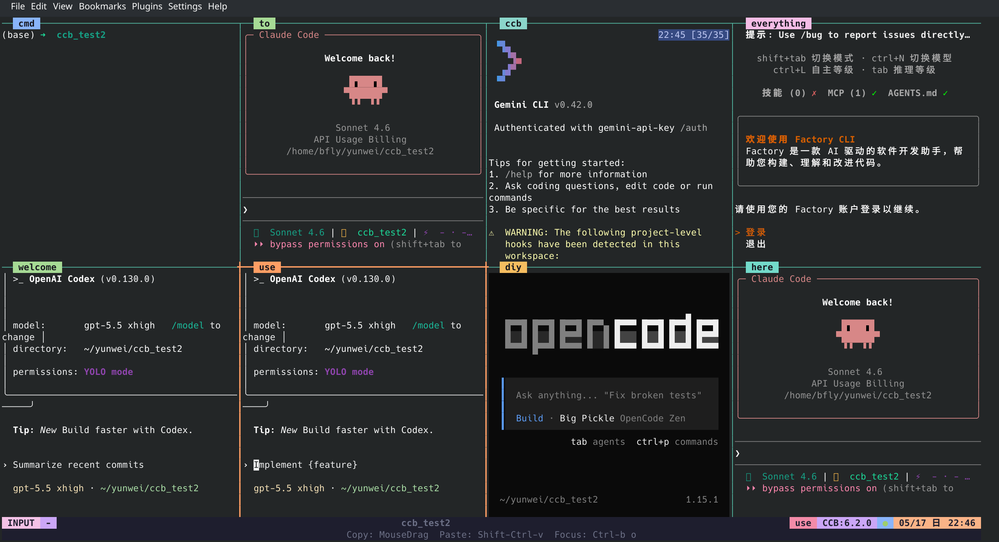

<div align="center">

# CCB v6(Linux) - Infinite Parallel Agents Edition

**Native multi-agent runtime for terminal split panes**
**Claude · Codex · Gemini · OpenCode · Droid · Kimi**
**Visible concurrency, native communication, project-scoped runtime**

<p>
  
  
</p>

[]()
[]()

**English** | [Chinese](README_zh.md)



<details>
<summary><b>Demo animations</b></summary>


</details>

</div>

---

**Introduction:** CCB v6 is the infinite parallel agents edition. It turns split-pane collaboration into a native multi-agent runtime where agents can run side by side, hold independent roles and personalities, and delegate to each other through a stable built-in communication layer.

## Why Parallel Agents Matter

Parallel agents are not just "more panes on screen". In CCB, each agent can own a fully independent role, task stream, skill library, and personality.

CCB provides the runtime foundation for stable agent-to-agent communication and effectively unbounded delegation. It supports arbitrary agent naming and window arrangement, per-agent control, broadcast dispatch, and point-to-point communication.

## 🚀 User Commands

- `ccb` start, restore, and attach CCB in the project directory from the terminal
- `ccb -s` safe mode
- `ccb -n` rebuild the project `.ccb` state
- `ccb kill` close CCB
- `ccb kill -f` deep-clean exit

## 💬 Communication Usage

Inside a provider / agent runtime:

- `/ask all "sync on the latest repo state"` broadcasts one message to all live agents.
- `/ask reviewer "review the new parser change"` sends work to the named `[reviewer]` agent.

Typical pattern:

- use `ask all` for one-shot broadcast or global sync
- use `ask agent_name` for targeted delegation
- use implicit skill-based calls; agents invoke `ask` themselves, and skills are currently auto-installed into Codex, Claude, and other providers
- if you only occasionally need to inspect replies manually, `pend` and `watch` are secondary tools

## 🛠 Config Control

`ccb` is controlled by `.ccb/ccb.config`. That file defines agent names, pane layout, and whether an agent runs `inplace` or in a separate git worktree.

Quick rules:

- `agent_name:provider` defines one agent. `agent_name` is also the pane label and logical runtime name.
- `cmd` adds one shell pane.
- `;` splits panes horizontally from left to right.
- `,` splits panes vertically from top to bottom.
- Default workspace mode is `inplace`. If one agent needs an isolated git worktree to avoid conflicts, write `agent_name:provider(worktree)`.

Example:

```text
cmd; writer:codex, reviewer:claude; qa:gemini(worktree)
```

This layout means:

- left pane: `cmd`
- right side: a vertical stack
- top-right pane: `writer`
- bottom-right side: a horizontal split between `reviewer` and `qa`
- `qa` runs in an isolated git worktree; `writer` and `reviewer` run inplace in the main project

<h2 align="center">🚀 What's New</h2>

Historical note: older release notes below may mention `askd`, legacy flags, or removed commands. Those references are kept only as changelog history and do not redefine the current CLI surface.

<details open>
<summary><b>v6.0.19</b> - Claude Official Login Inheritance</summary>

- **Claude Official Login Projection**: managed Claude homes now project Claude Code official login credentials from `.config/claude-code/auth.json`, so browser-login-backed auth can be inherited into isolated CCB runtimes instead of only API-token-based settings auth
- **Managed Login Auth Retention**: when global Claude auth artifacts disappear but managed Claude state already holds a valid project-scoped login, startup now preserves that managed login auth across restart instead of silently dropping it
- **Auth Cleanup And Regression Coverage**: disabling auth inheritance now clears stale copied Claude login credentials, and targeted tests now lock the projection, cleanup, and launcher startup paths

</details>

<details>
<summary><b>v6.0.18</b> - Gemini Hook Empty-Reply Guard</summary>

- **Empty Gemini Hook Replies No Longer Burn Jobs**: managed Gemini `AfterAgent` hooks that fire with an empty reply now downgrade to `incomplete` instead of terminalizing as a false exact completion
- **Exact Hook Polling Becomes Safer**: Gemini exact-hook polling now ignores `completed` hook artifacts with no reply text, allowing observed session-stability or timeout reliability paths to converge the request instead of accepting a blank terminal result
- **Regression Coverage Added**: targeted tests now lock the empty-reply guard at both the finish-hook artifact writer and Gemini execution-service polling layers

</details>

<details>
<summary><b>v6.0.17</b> - Gemini Custom Endpoint Env Propagation</summary>

- **Gemini Endpoint Override Restored**: managed Gemini startup now preserves `GOOGLE_GEMINI_BASE_URL` end to end, so custom endpoint and proxy-backed Gemini CLI setups no longer fall back to Google's default production API host
- **Gemini Model Env Allowlisted**: control-plane and provider-profile env filtering now preserve `GEMINI_MODEL`, allowing isolated Gemini agents to keep explicit model selection instead of silently dropping it at startup
- **Config Shortcut Alignment**: Gemini `key` / `url` shortcuts now materialize the same environment variables the current Gemini CLI actually reads, keeping explicit config-based routes aligned with shell-level env behavior

</details>

<details>
<summary><b>v6.0.16</b> - Codex Plugin Projection & Cmd Shell Compatibility</summary>

- **Codex Plugin Projection Fixed**: managed Codex homes now project plugin-bundle authority under `.tmp/plugins/` and `.tmp/plugins.sha`, so isolated agents inherit the marketplace catalog and installed plugin assets they actually need instead of starting with plugin-enabled config but missing bundles
- **Plugin Refresh Semantics Tightened**: startup now refreshes managed plugin projections as one authority unit, removes stale managed plugin residue when the source projection disappears, and keeps a cheap no-recopy fast path when the source plugin freshness marker is unchanged
- **Cmd Shell / Session Env Hardening**: the `cmd` pane now directly `exec`s the resolved user shell and preserves ordinary user-session transport variables such as `DISPLAY`, `WAYLAND_DISPLAY`, `DBUS_SESSION_BUS_ADDRESS`, `XAUTHORITY`, and `SSH_AUTH_SOCK`, improving fish/zsh and GUI-command compatibility

</details>

<details>
<summary><b>v6.0.15</b> - Codex Route Authority & Foreground Attach Polish</summary>

- **Codex Explicit Route Authority**: managed Codex homes now materialize agent-local `config.toml` and `auth.json` as the sole authority for explicit `key` / `url` routes, so agent-scoped API overrides replace inherited global provider routes instead of drifting back to system config
- **Codex Session Namespace Rotation**: managed Codex startup now fingerprints explicit route authority, stamps reusable session bindings with that authority, and rotates stale `sessions/` namespaces before launch when the bound route no longer matches
- **Foreground Attach UX Hardening**: interactive `ccb` startup now seeds tmux namespace creation from the real terminal viewport and issues a best-effort client refresh after attach so first paint matches the current terminal size without manual redraw

</details>

<details>
<summary><b>v6.0.14</b> - Claude Logout Recovery Hardening</summary>

- **Managed Claude Auth Preservation**: managed Claude homes now preserve agent-local login auth when the global Claude home has been logged out, so a project-scoped re-login survives restart instead of re-entering a browser-link loop
- **Auth Projection Semantics Tightened**: Claude startup still refreshes source auth when it exists, but no longer treats missing source auth as an instruction to blank managed auth; disabled auth inheritance still clears stale copied auth state
- **Startup Regression Coverage Expanded**: targeted regressions now lock this behavior at the projection layer, provider workspace preparation, and Claude launcher startup path

</details>

<details>
<summary><b>v6.0.13</b> - macOS Release Path & Preview Packaging Fix</summary>

- **macOS Release Path**: shared release artifact naming and updater resolution now cover the macOS universal bundle alongside Linux/WSL release assets
- **Source Dev Install Mode**: installs from a git checkout now stay linked to the live source tree, skip startup auto-update prompts, and can switch to a managed release install through `ccb update`
- **Agent API / Model Shortcuts**: `.ccb/ccb.config` now accepts flat per-agent `key`, `url`, and `model` shortcuts so common provider overrides stay concise
- **Preview Packaging Hardening**: preview release exports now exclude generated output paths inside the repo, fixing recursive self-copy failures such as `dist-macos-smoke`

</details>

<details>
<summary><b>v6.0.12</b> - Non-Blocking Startup Update Prompt</summary>

- **Cached Startup Prompt**: interactive foreground `ccb` start now reads install-scoped cached release metadata and only prompts when a newer stable release is already known locally
- **Background Refresh**: missing or stale update cache now refreshes in the background with short network budgets instead of delaying the project startup path
- **Upgrade / Defer / Silence**: startup prompt supports upgrade now, defer for the current version, or silence that exact version
- **Startup Boundary Preserved**: release-update checks remain advisory and outside the project lifecycle startup transaction

</details>

<details>
<summary><b>v6.0.11</b> - Project Startup Hotfix</summary>

- **Cold Start Namespace Fix**: project tmux namespace startup now treats `no server running on <project socket>` as an absent namespace that must be created, instead of failing startup as a generic tmux inspect error
- **Release Regression Coverage**: targeted namespace backend/state regression tests now lock this cold-start path so `ccb -> ping -> kill` blackbox lifecycle stays covered
- **Contract Clarification**: the startup supervision contract now explicitly defines project-socket `no server running` as a recreate signal rather than a fatal inspect failure

</details>

<details>
<summary><b>v6.0.10</b> - Startup Budget Hardening & Gemini Login Inheritance</summary>

- **Gemini Login Inheritance**: managed Gemini homes now project login-auth selection and `oauth_creds.json` for `oauth-personal` reuse, and remove stale copied credentials when auth inheritance is disabled
- **Shared Tmux Ready Budget**: project-owned `respawn-pane` now uses the same tmux ready-retry budget as namespace create/reflow, reducing transient `no server running` failures during startup and supervision
- **Background Startup Compatibility**: background lifecycle startup keeps supervision compatibility while separating readiness-probe timeouts from operational RPC budgets
- **Diagnostics Secret Redaction**: diagnostic bundles now exclude Gemini `oauth_creds.json` alongside other provider credential artifacts

</details>

<details>
<summary><b>v6.0.9</b> - Cross-Platform Lifecycle & Watch Stability</summary>

- **WSL Compatibility Fixed**: project runtime now avoids binding Unix sockets onto unsupported WSL mounted-drive filesystems and hardens installer staging plus tmux namespace readiness
- **macOS Lifecycle Hardening**: startup, restore, and project identity paths were tightened so macOS follows the same lifecycle authority model as Linux without intermittent startup drift
- **Respawn Retry Boundary**: transient tmux respawn fork, server-exit, and readiness failures are retried inside runtime supervision instead of leaking outward as false lifecycle failures
- **Watch Reconnect Recovery**: `watch` and ask wait can recover terminal results from persisted state after short daemon interruptions, while reconnect loops still honor timeout deadlines
- **Cross-Platform CI Coverage**: GitHub Actions now exercises macOS install smoke and WSL compatibility paths alongside the existing Linux matrix

</details>

<details>
<summary><b>v6.0.7</b> - Lifecycle Authority & Shutdown Stability</summary>

- **Keeper-Owned Lifecycle Authority**: keeper now owns lifecycle progression through authoritative `lifecycle.json`, generation fencing, and namespace epoch tracking
- **Mounted-State Read Fixes**: `ping ccbd` and `ping agent` now report current mounted state from live authority instead of stale failure residue after recovery
- **Shutdown Transaction Hardening**: `ccb kill` and `ccb kill -f` now terminate non-terminal jobs during shutdown so restart cannot resurrect old executions via restore or auto-retry
- **Real Blackbox Repro Closed**: the real `ask -> kill -f -> restart` lifecycle repro now converges cleanly to `project_shutdown` without lingering active execution

</details>

<details>
<summary><b>v6.0.6</b> - Agent Isolation Stability & Kill Lifecycle Fix</summary>

- **Agent Isolation Stability**: Codex, Claude, and Gemini managed agents keep their session state under project-scoped `.ccb/agents/<agent>/provider-state/...`
- **Restart Inheritance Safety**: restarts restore only the matching managed agent history instead of adopting manual provider conversations from the same working directory
- **Project Dotfile Protection**: managed startup no longer rewrites project-level `.claude`, `.gemini`, or `.codex` provider dotfiles
- **Kill Lifecycle Fix**: interactive `ccb` no longer reports a false attach failure after `ccb kill` intentionally tears down the current project tmux session

</details>

<details>
<summary><b>v6.0.5</b> - Agent Isolation Stability</summary>

- **Agent Isolation Stability**: Codex, Claude, and Gemini managed agents keep their session state under project-scoped `.ccb/agents/<agent>/provider-state/...`
- **Restart Inheritance Safety**: restarts restore only the matching managed agent history instead of adopting manual provider conversations from the same working directory
- **Project Dotfile Protection**: managed startup no longer rewrites project-level `.claude`, `.gemini`, or `.codex` provider dotfiles

</details>

<details>
<summary><b>v6.0.4</b> - Legacy Update Compatibility Hotfix</summary>

- **Backward-Compatible Release Assets**: Linux release tarballs now include a compatibility alias so older 6.x updaters can still find the extracted installer path
- **Old Clients Can Upgrade Again**: existing `v6.0.1` and `v6.0.2` installs can now update to the latest stable release without needing a patched local updater first
- **Modern Updater Still Clean**: current runtime keeps the correct extracted-directory resolution and does not depend on the legacy alias

</details>

<details>
<summary><b>v6.0.3</b> - Self-Update Tarball Hotfix</summary>

- **Release Upgrade Fixed**: `ccb update` now resolves the extracted release directory correctly instead of treating the `.tar.gz` asset name as a folder
- **Installer Handoff Restored**: self-update now finds `install.sh` inside extracted release assets and completes end to end
- **Release Build Hygiene**: Linux release packaging now ignores local `.ccb-requests/` residue so official builds are reproducible

</details>

<details>
<summary><b>v6.0.2</b> - Caller Attribution, Mailbox Routing, and macOS Install Warning</summary>

- **Correct Caller Identity**: `ccb ask` now preserves the real originating agent so replies return to the right mailbox instead of being attributed as `user`
- **Stable Reply Routing**: async replies for delegated jobs now land back in the expected mailbox chain, including `cmd`-anchored flows
- **Mixed-Case Agent Recovery**: config layout recovery no longer drifts when configured agent names use mixed case
- **macOS Homebrew Warning**: `install.sh` now warns clearly when Homebrew is missing before users try to install tmux and other dependencies

</details>

<details>
<summary><b>v6.0.1</b> - Release Archive Hygiene & Safer Upgrade Extraction</summary>

- **Source Archive Cleanup**: Removed accidentally tracked pytest temp artifacts so GitHub source archives are clean again
- **Safer Tar Validation**: Upgrade extraction now rejects unsafe symlink targets before unpacking
- **Clearer Failure Mode**: Unsafe archive extraction errors now point users toward release assets or clean source archives
- **Regression Coverage**: Added tests to block ephemeral repo artifacts from being tracked again

</details>

<details>
<summary><b>v6.0.0</b> - Native Multi-Agent Runtime, Stable Native Communication, and Linux-Only Auto Upgrade</summary>

**🚀 New Runtime Direction:**
- **Infinite Parallel Agent Foundation**: CCB v6 is built as the runtime base for effectively unbounded agent-to-agent delegation and orchestration
- **Independent Agent Identity**: agents can carry different roles, task ownership, skill libraries, and personalities
- **Focused User Command Surface**: the public user workflow stays centered on `ccb`, `ccb -s`, `ccb -n`, `ccb kill`, and `ccb kill -f`

**🧱 Project Rebuild Semantics:**
- **Config-Preserving Legacy Cleanup**: On first `ccb` inside a pre-6 project, CCB preserves `.ccb/ccb.config`, removes the rest of the old `.ccb` runtime state, and rebuilds locally
- **Runtime Marker**: Modern projects now record `.ccb/project-runtime.json` so current runtime state is distinguished from legacy state
- **Worktree Safety Guard**: Dirty or unmerged CCB-managed worktrees still block destructive rebuilds until the user resolves them

**🔄 Upgrade Policy:**
- **Linux/macOS/WSL**: `ccb update` is available on Linux, macOS, and WSL for the 6.x line
- **Release-Only Upgrades**: Source tags are still published with each version, but `ccb update` for 6.x installs the GitHub release asset, not the source archive
- **Stable Release Targeting**: Default upgrades now resolve to the latest stable release instead of the moving `main` branch
- **Major Upgrade Confirmation**: Upgrading into `6.0.0` requires explicit confirmation before replacing the installed runtime

**🤖 Provider Reliability:**
- **Gemini Multi-Round Stability**: Gemini completion polling now waits through tool activity and no longer exits on the first stable planning sentence

</details>

<details>
<summary><b>v5.3.0</b> - Simplified CLI, Explicit Worktree Mode, and Gemini Completion Stability</summary>

**🚀 User-Facing CLI Simplification:**
- **Narrowed Main Surface**: Public startup flow is now `ccb`, `ccb -s`, `ccb -n`, `ccb kill`, and `ccb kill -f`
- **Model Control Plane Still Available**: `ask`, `ping`, `pend`, and `watch` remain for agent-to-agent orchestration without cluttering primary help

**🧱 Workspace Semantics Made Explicit:**
- **Default Inplace Mode**: Compact `ccb.config` entries now expand to `workspace_mode='inplace'`
- **Opt-In Isolation**: Use `agent:provider(worktree)` when an agent must run in its own git worktree
- **Safe Agent Churn**: Adding agents no longer disturbs existing worktrees; removing or renaming worktree agents retires clean branches and blocks on dirty or unmerged ones

**🛠 Recovery & Reset Hardening:**
- **Config-Preserving Reset**: `ccb -n` rebuilds project runtime state while keeping `.ccb/ccb.config`
- **Stale Registration Cleanup**: Start and reset now prune missing registered git worktrees before rematerialization
- **Kill Warnings**: `ccb kill` warns clearly when a worktree agent still has unmerged or dirty state

**🤖 Gemini Completion Fix:**
- **No Early Stop on Planning Text**: Gemini completion polling now tracks tool-call activity and waits for the real final reply instead of finishing on the first stable “I will ...” message

</details>

<details>
<summary><b>v5.2.6</b> - Async Communication & Gemini 0.29 Compatibility</summary>

**🔧 Gemini CLI 0.29.0 Support:**
- **Dual Hash Strategy**: Session path discovery now supports both basename and SHA-256 formats
- **Autostart**: `ccb-ping` and `ccb-mounted` gain `--autostart` flag to launch offline provider daemons
- **Cleanup Path**: zombie-session cleanup is now handled by `ccb kill -f`

**🔗 Async Communication Fixes:**
- **OpenCode Deadlock**: Fixed session ID pinning that caused second async call to always fail
- **Legacy Completion Compatibility**: Legacy text-based providers still tolerate mismatched `CCB_DONE` lines in degraded mode
- **req_id Regex**: `opencode_comm.py` now matches both old hex and new timestamp-based formats
- **Gemini Idle Timeout**: Auto-detect reply completion when Gemini omits `CCB_DONE` marker (15s idle, configurable via `CCB_GEMINI_IDLE_TIMEOUT`)
- **Gemini Prompt Hardening**: Stronger instructions to reduce `CCB_DONE` omission rate

**🛠 Other Fixes:**
- **lpend**: Prefers fresh Claude session path when registry is stale

</details>

<details>
<summary><b>v5.2.5</b> - Async Guardrail Hardening</summary>

**🔧 Async Turn-Stop Fix:**
- **Global Guardrail**: Added mandatory `Async Guardrail` rule to `claude-md-ccb.md` — covers both `/ask` skill and direct `Bash(ask ...)` calls
- **Marker Consistency**: `bin/ask` now emits `[CCB_ASYNC_SUBMITTED provider=xxx]` matching all other provider scripts
- **DRY Skills**: Ask skill rules reference global guardrail with local fallback, single source of truth

This fix prevents Claude from polling/sleeping after submitting async tasks.

</details>

<details>
<summary><b>v5.2.3</b> - Project-Local History & Legacy Compatibility</summary>

**📂 Project-Local History:**
- **Local Storage**: Auto context exports now save to `./.ccb/history/` per project
- **Safe Scope**: Auto transfer runs only for the current working directory
- **Claude /continue**: New skill to attach the latest history file via `@`

**🧩 Legacy Compatibility:**
- **Auto Migration**: `.ccb_config` is detected and upgraded to `.ccb` when possible
- **Fallback Lookup**: Legacy sessions still resolve cleanly during transition

These changes keep handoff artifacts scoped to the project and make upgrades smoother.

</details>

<details>
<summary><b>v5.2.2</b> - Session Switch Capture & Context Transfer</summary>

**🔁 Session Switch Tracking:**
- **Old Session Fields**: `.claude-session` now records `old_claude_session_id` / `old_claude_session_path` with `old_updated_at`
- **Auto Context Export**: Previous Claude session is automatically extracted to `./.ccb/history/claude-<timestamp>-<old_id>.md`
- **Cleaner Transfers**: Noise filtering removes protocol markers and guardrails while keeping tool-only actions

These updates make session handoff more reliable and easier to audit.

</details>

<details>
<summary><b>v5.2.1</b> - Enhanced Ask Command Stability</summary>

**🔧 Stability Improvements:**
- **Watchdog File Monitoring**: Real-time session updates with efficient file watching
- **Mandatory Caller Field**: Improved request tracking and routing reliability
- **Unified Execution Model**: Simplified ask skill execution across all platforms
- **Auto-Dependency Installation**: Watchdog library installed automatically during setup
- **Session Registry**: Enhanced Claude adapter with automatic session monitoring

These improvements significantly enhance the reliability of cross-AI communication and reduce session binding failures.

</details>

<details>
<summary><b>v5.2.0</b> - Historical mail bridge release</summary>

This release introduced the old mail gateway path. That flow is now removed from the supported agent-first surface and remains legacy code only during cleanup.

</details>

<details>
<summary><b>v5.1.3</b> - Tmux Claude Ask Stability</summary>

**🔧 Fixes & Improvements:**
- **tmux Claude ask**: read replies from pane output with automatic pipe-pane logging for more reliable completion

See [CHANGELOG.md](CHANGELOG.md) for full details.

</details>

<details>
<summary><b>v5.1.2</b> - Daemon & Hooks Reliability</summary>

**🔧 Fixes & Improvements:**
- **Claude Completion Hook**: Unified askd now triggers completion hook for Claude
- **askd Lifecycle**: askd is bound to CCB lifecycle to avoid stale daemons
- **Mounted Detection**: `ccb-mounted` uses ping-based detection across all platforms
- **State File Lookup**: `askd_client` falls back to `CCB_RUN_DIR` for daemon state files

See [CHANGELOG.md](CHANGELOG.md) for full details.

</details>

<details>
<summary><b>v5.1.1</b> - Unified Daemon + Bug Fixes</summary>

**🔧 Bug Fixes & Improvements:**
- **Unified Daemon**: All providers now use unified askd daemon architecture
- **Install/Uninstall**: Fixed installation and uninstallation bugs
- **Process Management**: Fixed kill/termination issues

See [CHANGELOG.md](CHANGELOG.md) for full details.

</details>

<details>
<summary><b>v5.1.0</b> - Unified Command System + Historical Native Windows Experiment</summary>

**🚀 Unified Commands** - Replace provider-specific commands with agent-first workflows:

| Old Commands | New Unified Command |
|--------------|---------------------|
| `cask`, `gask`, `oask`, `dask`, `lask` | `ccb ask <agent> [from <sender>] <message>` |
| `cping`, `gping`, `oping`, `dping`, `lping` | `ccb ping <agent\|all>` |
| `cpend`, `gpend`, `opend`, `dpend`, `lpend` | `ccb pend <agent\|job_id> [N]` |

**Supported providers:** `gemini`, `codex`, `opencode`, `droid`, `claude`

**🪟 Historical native Windows experiment:**
- Earlier releases explored a native Windows split-pane path
- Background execution used PowerShell + `DETACHED_PROCESS`
- Large payload delivery used stdin-based handoff
- That backend has since been removed; future native Windows mux support is being redesigned around `psmux`

**📦 New Skills:**
- `/ask <agent> <message>` - Send work to a named agent
- `/ping <agent|all>` - Check mounted agent health
- `/pend <agent|job_id> [N]` - View latest agent reply

See [CHANGELOG.md](CHANGELOG.md) for full details.

</details>

<details>
<summary><b>v5.0.6</b> - Zombie session cleanup + mounted skill optimization</summary>

- **Zombie Cleanup**: `ccb kill -f` now cleans up orphaned tmux sessions globally (sessions whose parent process has exited)
- **Mounted Skill**: Optimized to use `pgrep` for daemon detection (~4x faster), extracted to standalone `ccb-mounted` script
- **Droid Skills**: Added full skill set (cask/gask/lask/oask + ping/pend variants) to `droid_skills/`
- **Install**: Added `install_droid_skills()` to install Droid skills to `~/.droid/skills/`

</details>

<details>
<summary><b>v5.0.5</b> - Droid delegation tools + setup</summary>

- **Droid**: Adds delegation tools (`ccb_ask_*` plus `cask/gask/lask/oask` aliases).
- **Setup**: New `ccb droid setup-delegation` command for MCP registration.
- **Installer**: Auto-registers Droid delegation when `droid` is detected (opt-out via env).

<details>
<summary><b>Details & usage</b></summary>

Usage:
```
/all-plan <requirement>
```

Example:
```
/all-plan Design a caching layer for the API with Redis
```

Highlights:
- Socratic Ladder + Superpowers Lenses + Anti-pattern analysis.
- Availability-gated dispatch (use only mounted CLIs).
- Two-round reviewer refinement with merged design.

</details>
</details>

<details>
<summary><b>v5.0.0</b> - Any AI as primary driver</summary>

- **Claude Independence**: No need to start Claude first; Codex can act as the primary CLI.
- **Unified Control**: Single entry point controls Claude/OpenCode/Gemini.
- **Simplified Launch**: Dropped `ccb up`; use `ccb ...` or the default `ccb.config`.
- **Flexible Mounting**: More flexible pane mounting and session binding.
- **Default Config**: Auto-create `ccb.config` when missing.
- **Project askd Autostart**: project askd and provider runtimes auto-start in the project tmux namespace when needed.
- **Session Robustness**: PID liveness checks prevent stale sessions.

</details>

<details>
<summary><b>v4.0</b> - tmux-first refactor</summary>

- **Full Refactor**: Cleaner structure, better stability, and easier extension.
- **Terminal Runtime Cleanup**: The runtime moved toward a single tmux-oriented pane/control model instead of parallel terminal backends.
- **Perfect tmux Experience**: Stable layouts + pane titles/borders + session-scoped theming.
- **Works in Any Terminal**: If your terminal can run tmux, CCB can provide the full multi-model split experience.

</details>

<details>
<summary><b>v3.0</b> - Smart daemons</summary>

- **True Parallelism**: Submit multiple tasks to Codex, Gemini, or OpenCode simultaneously.
- **Cross-AI Orchestration**: Claude and Codex can now drive OpenCode agents together.
- **Bulletproof Stability**: Daemons auto-start on first request and stop after idle.
- **Chained Execution**: Codex can delegate to OpenCode for multi-step workflows.
- **Smart Interruption**: Gemini tasks handle interruption safely.

<details>
<summary><b>Details</b></summary>

<div align="center">


</div>

<h3 align="center">✨ Key Features</h3>

- **🔄 True Parallelism**: Submit multiple tasks to Codex, Gemini, or OpenCode simultaneously. Provider runtimes queue and execute them serially, ensuring no context pollution.
- **🤝 Cross-AI Orchestration**: Claude and Codex can now simultaneously drive OpenCode agents. All requests are arbitrated by the project askd layer.
- **🛡️ Bulletproof Stability**: The runtime layer is self-managing. It starts on first use and shuts down after idleness to save resources.
- **⚡ Chained Execution**: Advanced workflows supported! Codex can autonomously call `oask` to delegate sub-tasks to OpenCode models.
- **🛑 Smart Interruption**: Gemini tasks now support intelligent interruption detection, automatically handling stops and ensuring workflow continuity.

<h3 align="center">🧩 Feature Support Matrix</h3>

| Feature | Codex | Gemini | OpenCode |
| :--- | :---: | :---: | :---: |
| **Parallel Queue** | ✅ | ✅ | ✅ |
| **Interruption Awareness** | ✅ | ✅ | - |
| **Response Isolation** | ✅ | ✅ | ✅ |

<details>
<summary><strong>📊 View Real-world Stress Test Results</strong></summary>

<br>

**Scenario 1: Claude & Codex Concurrent Access to OpenCode**
*Both agents firing requests simultaneously, perfectly coordinated by the daemon.*

| Source | Task | Result | Status |
| :--- | :--- | :--- | :---: |
| 🤖 Claude | `CLAUDE-A` | **CLAUDE-A** | 🟢 |
| 🤖 Claude | `CLAUDE-B` | **CLAUDE-B** | 🟢 |
| 💻 Codex | `CODEX-A` | **CODEX-A** | 🟢 |
| 💻 Codex | `CODEX-B` | **CODEX-B** | 🟢 |

**Scenario 2: Recursive/Chained Calls**
*Codex autonomously driving OpenCode for a 5-step workflow.*

| Request | Exit Code | Response |
| :--- | :---: | :--- |
| **ONE** | `0` | `CODEX-ONE` |
| **TWO** | `0` | `CODEX-TWO` |
| **THREE** | `0` | `CODEX-THREE` |
| **FOUR** | `0` | `CODEX-FOUR` |
| **FIVE** | `0` | `CODEX-FIVE` |

</details>
</details>
</details>

---

## 🚀 Quick Start

**Step 1:** Use a tmux-capable environment (`tmux` on Linux/macOS/WSL)

**Step 2:** Choose installer based on your environment:

<details open>
<summary><b>Linux</b></summary>

```bash
git clone https://github.com/bfly123/claude_code_bridge.git
cd claude_code_bridge
./install.sh install
```

</details>

<details>
<summary><b>macOS</b></summary>

```bash
git clone https://github.com/bfly123/claude_code_bridge.git
cd claude_code_bridge
./install.sh install
```

> **Note:** If commands not found after install, see [macOS Troubleshooting](#-macos-installation-guide).

</details>

<details>
<summary><b>WSL (Windows Subsystem for Linux)</b></summary>

> Use this if your Claude/Codex/Gemini runs in WSL.

> **⚠️ WARNING:** Do NOT install or run ccb as root/administrator. Switch to a normal user first (`su - username` or create one with `adduser`).

```bash
# Run inside WSL terminal (as normal user, NOT root)
git clone https://github.com/bfly123/claude_code_bridge.git
cd claude_code_bridge
./install.sh install
```

</details>

<details>
<summary><b>Windows Native</b></summary>

> Use this if your Claude/Codex/Gemini runs natively on Windows.

> Native Windows mux runtime is being redesigned around `psmux`. The stable split-pane path in this branch is still Linux/macOS/WSL + `tmux`.

```powershell
git clone https://github.com/bfly123/claude_code_bridge.git
cd claude_code_bridge
powershell -ExecutionPolicy Bypass -File .\install.ps1 install
```

- The installer prefers `pwsh.exe` (PowerShell 7+) when available, otherwise `powershell.exe`.

</details>

### Run
```bash
ccb                              # Start default agents from .ccb/ccb.config
ccb -s                           # Safe start: keep configured/manual permission behavior
ccb -n                           # Rebuild .ccb except ccb.config, then start fresh
ccb kill                         # Stop this project's background runtime
ccb kill -f                      # Force cleanup before rebuilding state

tmux tip: CCB's tmux status/pane theming is enabled only while CCB is running.
tmux tip: press `Ctrl+b` then `Space` to cycle tmux layouts. You can press it repeatedly to keep switching layouts.

Layout rule: the last selected agent runs in the current pane. Extras are ordered by the selected target list; the first extra goes to the top-right, then the left column fills top-to-bottom, then the right column fills top-to-bottom.
Note: `ccb up` is removed; use `ccb ...` with `.ccb/ccb.config`.
```

### Flags
| Flag | Description | Example |
| :--- | :--- | :--- |
| `-s` | Safe start; disable CLI auto-permission override | `ccb -s` |
| `-n` | Rebuild `.ccb` except `ccb.config`, then start fresh | `ccb -n` |
| `-h` | Show help information | `ccb -h` |
| `-v` | Show version and check for updates | `ccb -v` |

### ccb.config
Default lookup order:
- `.ccb/ccb.config` (project)
- `~/.ccb/ccb.config` (global)

Compact format only:
```text
writer:codex,reviewer:claude
```

Enable cmd pane (default title/command):
```text
agent1:codex,agent2:codex,agent3:claude,cmd
```

Rules:
- Each agent entry must be `agent_name:provider`.
- `cmd` is a reserved standalone token for the shell pane, not an agent name.
- `;` splits panes horizontally from left to right.
- `,` splits panes vertically from top to bottom.
- `(...)` groups part of the layout explicitly.
- Each agent entry expands to fixed defaults: `target='.'`, `workspace_mode='inplace'`, `restore='auto'`, `permission='manual'`.
- Use `agent_name:provider(worktree)` when you want that agent isolated in its own git worktree.
- Missing project config is auto-created as `codex:codex,claude:claude`.
- Cmd pane participates in the layout as the first extra pane and does not change which AI runs in the current pane.

### Update
CCB v6 currently supports `ccb update` on Linux, macOS, and WSL. A major upgrade fully replaces the installed runtime. On the first `ccb` inside an older project, CCB preserves `.ccb/ccb.config`, clears the rest of the old `.ccb` state, and rebuilds locally.

If you installed from a git checkout with `./install.sh install`, that install now runs in source dev mode:

- Global `ccb` and `ask` link back to the checkout instead of using a copied snapshot
- CCB-owned skills and helper scripts also follow the live source tree
- Source installs do not participate in startup auto-update prompts
- Stay on the source/dev track with `git pull` or by switching commits, then rerun `./install.sh install`
- Or run `ccb update` to install the latest stable release and repoint global `ccb` links to the managed release install

```bash
ccb update              # Update to the latest stable release
ccb update 6            # Update to the highest v6.x.x version
ccb update 6.0          # Update to the highest v6.0.x version
ccb update 6.0.5        # Update to a specific version
ccb uninstall           # Uninstall ccb and clean configs
ccb reinstall           # Clean then reinstall ccb
```

---

<details>
<summary><b>🪟 Windows Environment Guide</b></summary>

> **Key Point:** `ccb` and the underlying agent CLIs must run in the **same environment**. The most common issue is environment mismatch causing project startup or agent attach to fail.

Note: The installers also install OS-specific `SKILL.md` variants for Claude/Codex skills:
- Linux/macOS/WSL: bash heredoc templates (`SKILL.md.bash`)
- Native Windows: PowerShell here-string templates (`SKILL.md.powershell`)

### 1) Current backend status

- The active multi-pane runtime in this branch is `tmux` only.
- Stable split-pane usage today means Linux/macOS/WSL with `tmux`.
- Native Windows mux support is being redesigned around `psmux`; see [docs/ccbd-windows-psmux-plan.md](docs/ccbd-windows-psmux-plan.md).

### 2) How to Identify Your Environment

Determine based on **how you installed/run Claude Code/Codex**:

- **WSL Environment**
  - You installed/run via WSL terminal (Ubuntu/Debian) using `bash` (e.g., `curl ... | bash`, `apt`, `pip`, `npm`)
  - Paths look like: `/home/<user>/...` and you may see `/mnt/c/...`
  - Verify: `cat /proc/version | grep -i microsoft` has output, or `echo $WSL_DISTRO_NAME` is non-empty

- **Native Windows Environment**
  - You installed/run via Windows Terminal / PowerShell / CMD (e.g., `winget`, PowerShell scripts)
  - Paths look like: `C:\Users\<user>\...`

### 3) Recommended path today

- If you want the stable split-pane/runtime supervision path, run `ccb` and all agent CLIs inside WSL, then use `tmux`.
- If your tools currently run natively on Windows, keep that environment consistent, but treat native split-pane orchestration as transitional until `psmux` lands.

### 4) Troubleshooting: `ccb` Not Starting Correctly

- **Most common:** Environment mismatch (ccb in WSL but codex in native Windows, or vice versa)
- **tmux not available:** Install `tmux` in the environment where you run `ccb`
- **Terminal not refreshed:** Restart the shell after installation so PATH changes are visible

</details>

<details>
<summary><b>🍎 macOS Installation Guide</b></summary>

### Command Not Found After Installation

If `ccb` is not found after running `./install.sh install`:

**Cause:** The install directory (`~/.local/bin`) is not in your PATH.

**Solution:**

```bash
# 1. Check if install directory exists
ls -la ~/.local/bin/

# 2. Check if PATH includes the directory
echo $PATH | tr ':' '\n' | grep local

# 3. Check shell config (macOS defaults to zsh)
cat ~/.zshrc | grep local

# 4. If not configured, add manually
echo 'export PATH="$HOME/.local/bin:$PATH"' >> ~/.zshrc

# 5. Reload config
source ~/.zshrc
```

### tmux Shell Not Detecting Commands

If a shell started inside tmux cannot find ccb commands but a regular Terminal can:

- tmux may be starting a different shell init path
- Add PATH to `~/.zprofile` as well:

```bash
echo 'export PATH="$HOME/.local/bin:$PATH"' >> ~/.zprofile
```

Then restart the tmux server completely:

```bash
tmux kill-server
```

</details>

---

## 🗣️ Usage

Once started, collaborate naturally. Claude will detect when to delegate tasks.

**Common Scenarios:**

- **Code Review:** *"Have Codex review the changes in `main.py`."*
- **Second Opinion:** *"Ask Gemini for alternative implementation approaches."*
- **Pair Programming:** *"Codex writes the backend logic, I'll handle the frontend."*
- **Architecture:** *"Let Codex design the module structure first."*
- **Info Exchange:** *"Fetch 3 rounds of Codex conversation and summarize."*

### 🎴 Fun & Creative: AI Poker Night!

> *"Let Claude, Codex and Gemini play Dou Di Zhu! You deal the cards, everyone plays open hand!"*
>
> 🃏 Claude (Landlord) vs 🎯 Codex + 💎 Gemini (Farmers)

> **Note:** The public project runtime workflow in CCB v6 is intentionally small: `ccb`, `ccb -s`, `ccb -n`, `ccb kill`, and `ccb kill -f`. Internal control-plane commands still exist for agent-side orchestration, but they are not part of the user-facing startup/reset surface.

---

## 🛠️ User-Facing CLI

The public project runtime workflow in CCB v6 is intentionally reduced to five primary commands:

- **`ccb`** - Default start path; launch agents defined by `.ccb/ccb.config`
- **`ccb -s`** - Safe start; keep each agent's configured/default permission behavior
- **`ccb -n`** - Rebuild project `.ccb` state except `ccb.config`, then start fresh with confirmation
- **`ccb kill`** - Stop the current project's runtime
- **`ccb kill -f`** - Force cleanup project-owned runtime residue before `ccb -n`
  - Also works as a recovery path when `.ccb` exists but `ccb.config` is missing or stale

Internal control-plane commands still exist for model-side orchestration and automation, but they are intentionally not presented here as public user commands.

### Cross-Platform Support
- **Linux/macOS/WSL**: Uses `tmux` as terminal backend
- **Native Windows**: Mux runtime is being redesigned around `psmux`; this branch no longer ships a parallel legacy native backend

### Completion Hook
- Notifies caller upon task completion
- Supports caller-targeted completion notifications (`claude`/`codex`/`droid`)
- Compatible with the tmux backend used by the current branch
 - Foreground ask suppresses the hook unless `CCB_COMPLETION_HOOK_ENABLED` is set

---

## 🧩 Skills

- **/all-plan**: Collaborative multi-AI design with Superpowers brainstorming.

<details>
<summary><b>/all-plan details & usage</b></summary>

Usage:
```
/all-plan <requirement>
```

Example:
```
/all-plan Design a caching layer for the API with Redis
```

How it works:
1. **Requirement Refinement** - Socratic questioning to uncover hidden needs
2. **Parallel Independent Design** - Each AI designs independently (no groupthink)
3. **Comparative Analysis** - Merge insights, detect anti-patterns
4. **Iterative Refinement** - Cross-AI review and critique
5. **Final Output** - Actionable implementation plan

Key features:
- **Socratic Ladder**: 7 structured questions for deep requirement mining
- **Superpowers Lenses**: Systematic alternative exploration (10x scale, remove dependency, invert flow)
- **Anti-pattern Detection**: Proactive risk identification across all designs

When to use:
- Complex features requiring diverse perspectives
- Architectural decisions with multiple valid approaches
- High-stakes implementations needing thorough validation

</details>

---

## Legacy Cleanup Note

The legacy mail subsystem has been removed from the repo. The current runtime is project-scoped around `.ccb/ccb.config`, and old runtime state can be cleared and rebuilt.

---


> Combine with editors like **Neovim** for seamless code editing and multi-model review workflow. Edit in your favorite editor while AI assistants review and suggest improvements in real-time.

---

## 📋 Requirements

- **Python 3.10+**
- **Terminal:** `tmux`

---

## 🗑️ Uninstall

```bash
ccb uninstall
ccb reinstall

# Fallback:
./install.sh uninstall
```

---

<div align="center">

**Stable runtime:** Linux/macOS/WSL + tmux

**Native Windows mux:** planned around `psmux`

---

**Join our community**

📧 Email: bfly123@126.com
💬 WeChat: seemseam-com


</div>

---

<details>
<summary><b>Version History</b></summary>

### v5.0.6
- **Zombie Cleanup**: `ccb kill -f` cleans up orphaned tmux sessions globally
- **Mounted Skill**: Optimized with `pgrep`, extracted to `ccb-mounted` script
- **Droid Skills**: Full skill set added to `droid_skills/`

### v5.0.5
- **Droid**: Add delegation tools (`ccb_ask_*` and `cask/gask/lask/oask`) plus `ccb droid setup-delegation` for MCP install

### v5.0.4
- **OpenCode**: 修复 `-r` 恢复在多项目切换后失效的问题

### v5.0.3
- **Daemons**: 全新的稳定守护进程设计

### v5.0.1
- **Skills**: New `/all-plan` with Superpowers brainstorming + availability gating; Codex `lping/lpend` added; `gask` keeps brief summaries with `CCB_DONE`.
- **Status Bar**: Role label now reads role name from `.autoflow/roles.json` (supports `_meta.name`) and caches per path.
- **Installer**: Copy skill subdirectories (e.g., `references/`) for Claude/Codex installs.
- **CLI**: Added `ccb uninstall` / `ccb reinstall` with Claude config cleanup.
- **Routing**: Tighter project/session resolution (prefer `.ccb` anchor; avoid cross-project Claude session mismatches).

### v5.0.0
- **Claude Independence**: No need to start Claude first; Codex (or any agent) can be the primary CLI
- **Unified Control**: Single entry point controls Claude/OpenCode/Gemini equally
- **Simplified Launch**: Removed `ccb up`; default `ccb.config` is auto-created when missing
- **Flexible Mounting**: More flexible pane mounting and session binding
- **Project askd Autostart**: project askd and provider runtimes auto-start in the project tmux namespace when needed
- **Session Robustness**: PID liveness checks prevent stale sessions

### v4.1.3
- **Codex Config**: Automatically migrate deprecated `sandbox_mode = "full-auto"` to `"danger-full-access"` to fix Codex startup
- **Stability**: Fixed race conditions where fast-exiting commands could close panes before `remain-on-exit` was set
- **Tmux**: More robust pane detection (prefer stable `$TMUX_PANE` env var) and better fallback when split targets disappear

### v4.1.2
- **Performance**: Added caching for tmux status bar (git branch & ccb status) to reduce system load
- **Strict Tmux**: Explicitly require `tmux` for auto-launch; removed error-prone auto-attach logic
- **CLI**: Added `--print-version` flag for fast version checks

### v4.1.1
- **CLI Fix**: Improved flag preservation (e.g., `-a`) when relaunching `ccb` in tmux
- **UX**: Better error messages when running in non-interactive sessions
- **Install**: Force update skills to ensure latest versions are applied

### v4.1.0
- **Async Guardrail**: `cask/gask/oask` prints a post-submit guardrail reminder for Claude
- **Sync Mode**: add `--sync` to suppress guardrail prompts for Codex callers
- **Codex Skills**: update `oask/gask` skills to wait silently with `--sync`

### v4.0.9
- **Project_ID Simplification**: `ccb_project_id` uses current-directory `.ccb/` anchor (no ancestor traversal, no git dependency)
- **Codex Skills Stability**: Codex `oask/gask` skills default to waiting (`--timeout -1`) to avoid sending the next task too early

### v4.0.8
- **Codex Log Binding Refresh**: the Codex runtime now periodically refreshes `.codex-session` log paths by parsing `start_cmd` and scanning latest logs
- **Tmux Clipboard Enhancement**: Added `xsel` support and `update-environment` for better clipboard integration across GUI/remote sessions

### v4.0.7
- **Tmux Status Bar Redesign**: Dual-line status bar with modern dot indicators (●/○), git branch, and CCB version display
- **Session Freshness**: Always scan logs for latest session instead of using cached session file
- **Simplified Auto Mode (Historical)**: auto-permission behavior was consolidated into the current primary start flow

### v4.0.6
- **Session Overrides**: `cping/gping/oping/cpend/opend` support `--session-file` / `CCB_SESSION_FILE` to bypass wrong `cwd`

### v4.0.5
- **Gemini Reliability**: Retry reading Gemini session JSON to avoid transient partial-write failures
- **Claude Code Reliability**: `gpend` supports `--session-file` / `CCB_SESSION_FILE` to bypass wrong `cwd`

### v4.0.4
- **Fix**: Auto-repair duplicate `[projects.\"...\"]` entries in `~/.codex/config.toml` before starting Codex

### v4.0.3
- **Project Cleanliness**: Store session files under `.ccb/` (fallback to legacy root dotfiles)
- **Claude Code Reliability**: `cask/gask/oask` support `--session-file` / `CCB_SESSION_FILE` to bypass wrong `cwd`
- **Codex Config Safety**: Write auto-approval settings into a CCB-marked block to avoid config conflicts

### v4.0.2
- **Clipboard Paste**: Cross-platform support (xclip/wl-paste/pbpaste) in tmux config
- **Install UX**: Auto-reload tmux config after installation
- **Stability**: Default TMUX_ENTER_DELAY set to 0.5s for better reliability

### v4.0.1
- **Tokyo Night Theme**: Switch tmux status bar and pane borders to Tokyo Night color palette

### v4.0
- **Full Refactor**: Rebuilt from the ground up with a cleaner architecture
- **Perfect tmux Support**: First-class splits, pane labels, borders and statusline
- **Works in Any Terminal**: Recommended to run everything in tmux (except native Windows)

### v3.0.0
- **Smart Runtime Queue**: project askd with 60s idle timeout and provider queue support
- **Cross-AI Collaboration**: Support multiple agents (Claude/Codex) calling one agent (OpenCode) simultaneously
- **Interruption Detection**: Gemini now supports intelligent interruption handling
- **Chained Execution**: Codex can call `oask` to drive OpenCode
- **Stability**: Robust queue management and lock files

### v2.3.9
- Fix oask session tracking bug - follow new session when OpenCode creates one

### v2.3.8
- Plan mode enabled for autoflow projects regardless of `-a` flag

### v2.3.7
- Per-directory lock: different working directories can run cask/gask/oask independently

### v2.3.6
- Add non-blocking lock for cask/gask/oask to prevent concurrent requests
- Unify oask with cask/gask logic (use _wait_for_complete_reply)

### v2.3.5
- Fix plan mode conflict with auto mode (--dangerously-skip-permissions)
- Fix oask returning stale reply when OpenCode still processing

### v2.3.4
- Auto-enable plan mode when autoflow is installed

### v2.3.3
- Simplify cping.md to match oping/gping style (~65% token reduction)

### v2.3.2
- Optimize skill files: extract common patterns to docs/async-ask-pattern.md (~60% token reduction)

### v2.3.1
- Fix race condition in gask/cask: pre-check for existing messages before wait loop

</details>
