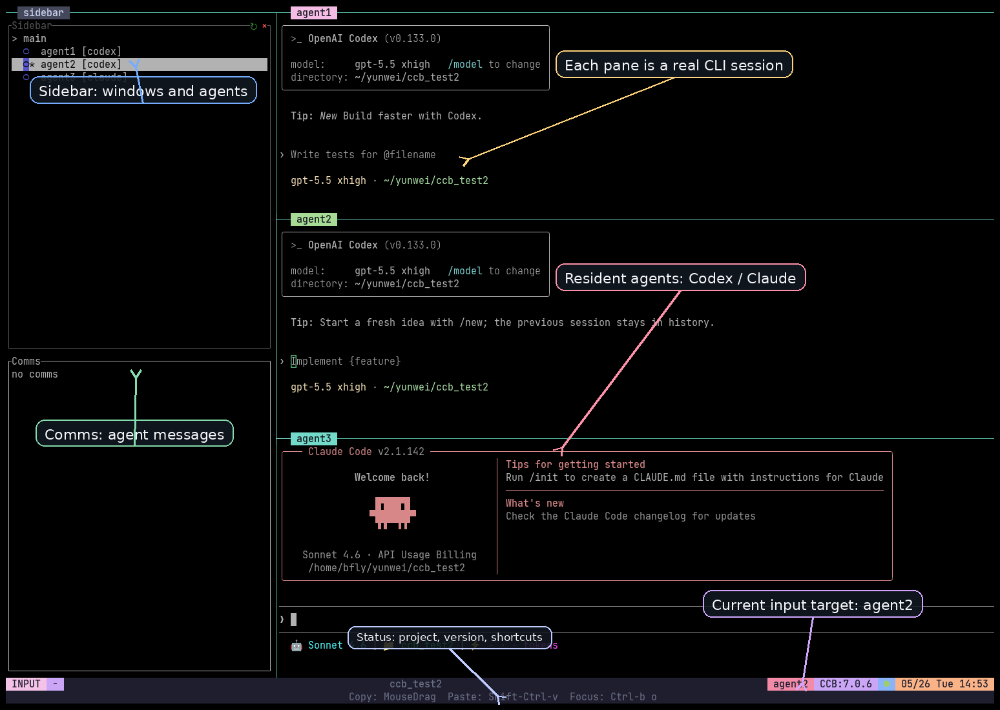

<div align="center">

# CCB - Visible, Controllable Multi-Agent CLI Workspace

<p>
  
  
  
</p>

[]()
[]()
[]()
[]()

**English** | [中文](README_zh.md)

[Why Multi Agents](#why-multi-agents) · [Comparison](#which-multi-agent-approach-should-you-use) · [v7 UI](#v7-ui-tour) · [Quick Start](#quick-start) · [tmux Basics](#tmux-basics) · [Configure Agents](#configure-your-agent-team) · [Install](#install-and-update)

</div>

---

## Why Multi Agents

A single agent is enough for small tasks. Once work needs planning, parallel edits, review, testing, and handoff, multi agents help separate roles, context, models, and execution. CCB focuses on putting multiple real CLI agents into one visible terminal workspace.

| Value | Plain meaning |
| :--- | :--- |
| Role separation | `main` plans, `worker` implements, `reviewer` checks risk. |
| Parallel progress | One agent can edit while another reads docs, validates, or reviews. |
| Model and context layering | Different agents can use different providers, models, APIs, worktrees, and memory. |

<details>
<summary><b>Why one agent starts to struggle</b></summary>

- Mixed roles reduce context focus: one conversation tries to architect, edit, test, and review itself.
- Complex task execution has a ceiling: long work needs split points, handoffs, checks, and rollback boundaries.
- Cost pressure is higher: if every step needs the strongest model, even simple sub-tasks become expensive.
- Tool and skill management becomes harder: a "does everything" agent also accumulates too much authority and instruction load.
- Serial waiting is inefficient: when one agent is reading logs or running tests, other independent work cannot naturally continue.

</details>

## Which Multi-Agent Approach Should You Use?

Multi-agent systems are not one fixed shape. Use the short table first; expand the details only if you are comparing tradeoffs.

| Approach | One-line summary | Best fit |
| :--- | :--- | :--- |
| [Claude Code native subagents](https://code.claude.com/docs/en/sub-agents) / [agent teams](https://code.claude.com/docs/en/agent-teams) | Native delegation inside Claude Code. | You mostly stay in Claude Code and want more coordination handled by a Claude lead. |
| [Hive / OpenHive](https://github.com/aden-hive/hive) | Production-oriented multi-agent workflow harness. | You need state, recovery, observability, cost controls, and graph workflows. |
| CCB | Visible, controllable local CLI-agent workspace with mixed providers. | You want Codex, Claude, Gemini, OpenCode, Antigravity, and other real CLIs in one project terminal. |

<details>
<summary><b>Details: model choice, control, context, and complex workflows</b></summary>

| Question | Claude Code native | Hive / OpenHive | CCB |
| :--- | :--- | :--- | :--- |
| Different model vendors? | Can choose Claude models for teammates/subagents; overall path is still Claude Code. | LiteLLM route covers many hosted and local providers. | Choose Codex, Claude, Gemini, OpenCode, Droid, Antigravity, and per-agent model/key/url. |
| Is the process visible? | In-process or split panes depending on mode. | Runtime observability and dashboard-style control. | Real tmux panes by default; users can click, type, copy, and inspect each CLI. |
| Is topology controllable? | Natural-language teammate setup, with much coordination handled by the lead. | Goal-generated graph-like topology, harness oriented. | Config explicitly defines agents, windows, panes, worktrees, and sidebar behavior. |
| Is context manageable? | Subagents/teammates have separate contexts; teams have task and message state. | Role memory, durable state, and recovery are core design points. | Each CLI keeps its provider session; shared project memory and per-agent memory are optional. |
| Best landing zone | Fast delegation inside Claude Code. | Business automation, long-running workflows, production reliability. | Local development with visible cross-provider CLI agents. |

CCB also supports complex workflows, but it is not an automatic DAG generator. You design complexity explicitly through `.ccb/ccb.config`, windows, role memory, worktrees, model/API settings, and ask/callback routes.

</details>

## What Is CCB?

> **Name evolution**: CCB originally stood for "Claude Code Bridge". As the project grew to support multiple AI providers (Codex, Claude, Gemini, OpenCode, Kimi, Droid, MMX), the acronym now represents **"Collaborative Code Bridge"** — a project-level workspace where multiple CLI agents collaborate.

CCB is a project-level agent CLI workspace. It uses tmux to manage multiple real CLI agents and unifies startup, restore, communication, configuration, windows, and runtime state for one project.

- **Real CLI sessions, not fake panels**: every agent pane runs the actual provider CLI.
- **Visible collaboration**: the sidebar shows windows, agents, status, and communication; users can switch panes by mouse.
- **Mixed providers**: one project can run Codex, Claude, Gemini, OpenCode, Droid, and Antigravity (`agy`) together.
- **Project config**: `.ccb/ccb.config` defines the team, layout, windows, worktrees, model, key, and url.
- **Roles**: a new role packaging model that lets specialized agents carrying
  "heavy weapons" such as independent skills, memory, and tool dependencies
  instantly land in a target project as hot-loadable, removable agents, while
  leaving the main environment, user global config, and project runtime state
  unchanged.
- **Recoverable runtime**: CCB supervises agent panes and supports attach, restore, and project-scoped cleanup.
- **Explicit collaboration channel**: agents can delegate through `/ask`, `$ask`, callback, and silence routes.

## v7 UI Tour

This screenshot is a real dark terminal session from the `ccb_test2` project. The labels explain the regions; you do not need to memorize every shortcut first.

<p align="center">
  
</p>

| Region | Purpose |
| :--- | :--- |
| Sidebar | Shows the current window, agent list, provider labels, selected agent, and status hints. |
| Comms | Shows ask/callback communication and collaboration status. |
| Agent pane | Each pane is a real CLI session, such as Codex or Claude. |
| Current input target | The status bar and pane border show where your input goes. |
| Status bar | Shows project name, current agent, CCB version, date, and mouse/keyboard hints. |
| Window grouping | v7 `[windows]` can group agents into main, work, review, research, or other workflow windows. |

The sidebar implementation uses ideas from [tmux-agent-sidebar](https://github.com/hiroppy/tmux-agent-sidebar). Thanks to that project.

## Quick Start

### 1. Install or update

New users should start from a release package. Download the matching package from [Releases](https://github.com/SeemSeam/claude_codex_bridge/releases), then install it:

```bash
tar -xzf ccb-*.tar.gz
cd ccb-*
./install.sh install
```

If CCB is already installed:

```bash
ccb update
```

<details>
<summary><b>Source install is for development or fallback use</b></summary>

```bash
git clone https://github.com/SeemSeam/claude_codex_bridge.git
cd claude_codex_bridge
./install.sh install
```

Source installs link global `ccb` / `ask` back to the checkout. Regular users should prefer a stable release install or update.

</details>

### 2. Create project config

Create `.ccb/ccb.config` in your project root. For v7, it is better to understand config from multi-window topology first: `[windows]` defines tmux windows and agent groups, `agent:provider` defines which CLI each agent uses, and `(worktree)` gives an agent its own git worktree.

```toml
version = 2
entry_window = "main"

[windows]
main = "main:codex"
work = "worker1:codex(worktree), worker2:claude(worktree)"
review = "reviewer:claude, qa:gemini"

[ui.sidebar]
mode = "every_window"
width = "15%"
bottom_height = 20

[ui.sidebar.view]
agents_height = "50%"
comms_height = "15%"
tips_height = "35%"
comms_limit = 3
```

If you are not sure how to group windows, how many workers you need, which agents should use worktrees, or which agents need separate models or API routes, ask an agent with the `ccb-config` skill to discuss and generate the config proposal with you.

Validate the config:

```bash
ccb config validate
```

Start the workspace:

```bash
ccb
```

### 3. Collaborate

Type directly in an agent pane, or route work between agents:

```text
/ask reviewer review the latest parser changes and list blocking issues.
```

## Daily Operation

| Goal | Command |
| :--- | :--- |
| Start or reattach the current project workspace | `ccb` |
| Safe start, keeping configured/manual permission behavior | `ccb -s` |
| Rebuild runtime state while keeping config and same-name managed agent history | `ccb -n` |
| Stop this project's background runtime | `ccb kill` |
| Force cleanup before rebuilding | `ccb kill -f` then `ccb -n` |
| Update to the latest stable release | `ccb update` |
| Inspect the active config layer | `ccb config validate` |
| Preview a config reload plan without changing tmux | `ccb reload --dry-run` |
| Apply supported config changes without restarting other agents | `ccb reload` |

## tmux Basics

CCB can be used mostly with the mouse, but learning a few tmux shortcuts makes daily work much faster. This section lists only common tmux keyboard operations.

In this section, `<prefix>` means `Ctrl-b`: **press `Ctrl-b`, release it, then press the function key**. Use an English input method for the function key so punctuation keys are not intercepted by another IME.

| Goal | Function key | Notes |
| :--- | :--- | :--- |
| Move to an adjacent pane | `h` / `j` / `k` / `l` or Arrow keys | CCB-managed tmux sessions enable Vim-style pane focus keys. |
| Resize current pane | `H` / `J` / `K` / `L` | Repeatable resize keys in Vim directions. |
| Move to the next pane | `o` | Fast rotation when direction does not matter. |
| Zoom / unzoom current pane | `z` | Useful for long output, diffs, and logs. |
| Open window / pane list | `w` | Pick a target in larger layouts. |
| Next window | `n` | Switch to the next tmux window. |
| Previous window | `p` | Switch to the previous tmux window. |
| Jump to numbered window | `0` to `9` | Jump directly by tmux window number. |
| Enter copy / scroll mode | `[` | Review history, scroll, and select text. |
| Exit copy / scroll mode | `q` or `Esc` | Return to normal input. |
| Paste tmux buffer | `]` | Paste content copied into tmux's own buffer. |
| Detach session | `d` | Leave the display without stopping CCB; you can reattach later. |

Copy and paste tips:

- **Mouse copy**: in most terminals, drag with the left mouse button to copy; if tmux captures the drag, enter copy / scroll mode first.
- **Bypass tmux selection**: many terminals support `Shift + mouse drag` for native terminal selection.
- **System paste**: Linux/Windows terminals usually use `Ctrl+Shift+V`; macOS terminals usually use `Cmd+V`.
- **tmux paste**: if the content is in the tmux buffer, use function key `]`.

<details>
<summary><b>More common tmux operations</b></summary>

| Goal | Function key | Notes |
| :--- | :--- | :--- |
| Scroll in copy / scroll mode | `PageUp` / `PageDown` / `Arrow keys` | Terminal support can vary. |
| Start selection in copy / scroll mode | `v` | CCB uses tmux vi copy mode. |
| Copy selection in copy / scroll mode | `y` | Copies to the tmux buffer and exits copy mode. |
| Search in copy / scroll mode | `Ctrl-s` / `Ctrl-r` | Commonly forward / backward search. |
| Create a window | `c` | Use only when you intentionally need another shell. |
| Rename a window | `,` | Helps identify multi-window workflows. |
| Show tmux key help | `?` | Useful when you forget a shortcut. |

New users should avoid pane/window killing shortcuts at first. To stop a CCB project, prefer CCB's project-level shutdown command instead of killing one recoverable pane by accident.

</details>

## Configure Your Agent Team

CCB resolves config in three layers, from lowest to highest priority:

1. Built-in default config.
2. User config at `~/.ccb/ccb.config`.
3. Project config at `.ccb/ccb.config`.

Higher layers replace lower layers as a whole; they are not merged. The project authority file is `.ccb/ccb.config`. The old `.ccb_config/ccb.config` path is legacy migration evidence only.
The built-in default is a v2 `[windows]` config with `agent1`, `agent2`, `agent3`, and a managed `neovim` tool window using `ccb-nvim`.

`.ccb/ccb.config` mainly controls:

| Config area | Syntax or location | Notes |
| :--- | :--- | :--- |
| Window grouping | `[windows]` | Group agents into tmux windows such as `main`, `work`, `review`, or `research`. |
| Agent name and provider | `main:codex`, `reviewer:claude` | Names are used by the UI, ask routing, and memory files; provider decides which CLI starts. |
| Workspace isolation | `worker1:codex(worktree)` | Gives implementation agents isolated git worktrees to reduce accidental overlap. |
| Sidebar behavior | `[ui.sidebar]` | Controls whether the sidebar appears in every window, plus width and Comms height. |
| Tool windows | `[tool_windows.<name>]` | Add managed non-agent windows such as Neovim; they appear as one sidebar row and are not `ask` targets. |
| Per-agent model/API | `[agents.<name>]` | Configure `model`, `key`, `url`, and related agent-local overrides. |
| Role Pack binding | `agentroles.archi:codex` | Bind a reusable role package through a window leaf; role assets are installed once and projected into the derived agent. |
| Role description | `[agents.<name>] description = "..."` | Give an agent a short responsibility note; longer workflow rules belong in memory. |

After editing `.ccb/ccb.config` in a mounted project, run `ccb reload --dry-run` to preview the plan and `ccb reload` to apply it. The explicit reload path can dynamically add agents, add windows, add/remove managed tool windows, unload idle agents, and remove idle windows while keeping unrelated agents and panes running. It does not run as a background file watcher, and unsafe changes such as busy unloads, provider replacement, agent moves, tool command replacement, and arbitrary reshapes are rejected without killing existing panes.

If you want to discuss the configuration before writing it by hand, use the `ccb-config` skill and describe the target team. It proposes a complete config first, then writes `.ccb/ccb.config` only after confirmation.

### Role Packs

Role Packs define reusable agent roles. A role can carry a stable identity,
responsibilities, memory, provider-specific skills, tool hooks, and dependency
setup. This keeps project config short and makes specialized agents reusable
instead of copying long role instructions into every project.

The current catalog role is `agentroles.archi`, an architecture reviewer role
from `agent-roles-spec` backed by Architec. More specialized roles will be
added over time. Install or refresh catalog roles when prompted during
`install.sh install`; `ccb update` refreshes already installed roles and reports
new catalog roles. You can also refresh manually:

```bash
ccb roles update agentroles.archi
```

To use the role in a project, add it as a window leaf:

```bash
ccb roles add agentroles.archi:codex
ccb reload
```

This writes the compact form `agentroles.archi:codex`. At runtime CCB resolves
it to the project-local agent `archi`, then projects the role memory and skills
into that agent's managed provider home.

<details>
<summary><b>Config format examples: single window, multi-window, per-agent model/API</b></summary>

### Single-window compact config

```text
cmd; main:codex, worker1:codex(worktree); reviewer:claude
```

Meaning:

- `cmd` is a shell pane, not an agent.
- `main`, `worker1`, and `reviewer` are agent names.
- `codex` and `claude` are providers.
- `;` splits left-to-right; `,` stacks top-to-bottom.
- `(worktree)` means that agent uses an isolated git worktree.

### Multi-window topology

When you want planning, implementation, review, and research in different tmux windows, use `version = 2` and `[windows]`:

```toml
version = 2
entry_window = "main"

[windows]
main = "main:codex"
work = "worker1:codex(worktree), worker2:claude(worktree)"
review = "reviewer:claude, qa:gemini"

[ui.sidebar]
mode = "every_window"
width = "15%"
bottom_height = 20

[ui.sidebar.view]
agents_height = "50%"
comms_height = "15%"
tips_height = "35%"
comms_limit = 3
```

Note: `cmd` belongs to compact/hybrid single-window layouts. Do not put `cmd` inside `[windows]`.

### Managed Neovim tool window

Tool windows are tmux windows managed by CCB, but they are not agents. They do not appear in `ccb ask` targets and do not create provider runtime records.

```toml
version = 2
entry_window = "main"

[windows]
main = "main:codex"

[tool_windows.neovim]
command = "ccb-nvim"
label = "neovim"
```

`ccb tools install neovim` prepares an isolated `ccb-nvim` wrapper and LazyVim profile under CCB-owned XDG paths. `install.sh install` and `ccb update` ask in interactive terminals whether to install or refresh this tool. Non-interactive installs skip it and print the follow-up command. Set `CCB_INSTALL_NEOVIM=1` to force provisioning or `CCB_INSTALL_NEOVIM=0` to skip it.
If `nvim` is not already on `PATH`, provisioning attempts to download the official Neovim release tarball for Linux/macOS and verifies the release sha256 before activating it. It does not write `~/.config/nvim`.
The managed profile defaults to ASCII icons so terminals without Nerd Font support do not show unreadable boxes. To opt back into LazyVim glyph icons, launch with `CCB_LAZYVIM_ICON_STYLE=glyph ccb-nvim`.
Use `ccb tools doctor neovim` to verify the managed profile. A working LazyVim setup reports `neovim_status: ok` and `lazyvim_health_status: ok`; damaged or partially downloaded plugin trees report `degraded` and can be repaired by rerunning `ccb tools install neovim`.

### Per-agent model, API key, or base URL

Use compact format when layout is enough. If some agents need separate models or API routes, keep the compact header and add TOML overlays:

```toml
cmd; fast:codex, deep:codex; reviewer:claude

[agents.fast]
model = "gpt-5-mini"

[agents.deep]
key = "sk-..."
url = "https://api.example.com/v1"
model = "gpt-5"

[agents.reviewer]
model = "sonnet"
```

Do not commit real API keys to a public repository. `key` / `url` are agent-local shortcuts; advanced provider environment variables belong in provider profile or agent env fields.

</details>

## Use the ccb-config Skill

If you do not want to hand-write `.ccb/ccb.config`, ask an agent that supports skills to use `ccb-config`. Describe your project goal, parallelism, window grouping, worktree isolation, provider/model/API preferences, then let it discuss the shape with you and propose a complete config.

Example:

```text
$ccb-config Design a team for a Python library: main coordinates work, three workers implement in worktrees, and one reviewer checks regressions and risks. You can recommend whether this should stay single-window or become main/work/review windows.
```

<details>
<summary><b>ccb-config write flow and boundaries</b></summary>

1. Describe the project and team goal in natural language.
2. `ccb-config` reads the current config authority and decides whether this is a new config, an edit, or a migration.
3. It proposes one complete config before writing.
4. You confirm the proposal, then it edits only `.ccb/ccb.config`.
5. It validates the config and tells you to use `ccb reload --dry-run` / `ccb reload` when the change can be applied dynamically.

By default, `ccb-config` does not edit `.ccb/ccb_memory.md` or `.ccb/agents/<agent>/memory.md`. It should touch those memory files only when you explicitly ask for workflow memory or role memory design.

</details>

## Agent Collaboration

Normal `ask` is submit-and-return: after handing work to the target agent, the current agent should not poll and wait.

| Scenario | Recommended route |
| :--- | :--- |
| Human directly targets an agent | `/ask reviewer ...` or `$ask reviewer ...` |
| Current agent is inside an active CCB task and needs a child result before replying | `ask --callback reviewer` |
| Current agent sends independent work whose successful result does not need to return | `ask --silence worker1` |
| Queue or status diagnostics | `pend`, `watch`, `ping`, and similar commands are diagnostics only |

<details>
<summary><b>Why callback matters</b></summary>

If agent A is handling a user-originated CCB task and needs agent B's result to finish, A should use callback. CCB records the parent/child relationship, lets A's current turn end, and later delivers B's result back to A as a continuation. That avoids polling, queue blocking, and wasted context.

</details>

## Editor Workflow

<p align="center">
  
</p>

CCB does not require leaving your editor. A common setup is: editor for code, CCB terminal for multi-agent planning, implementation, review, testing, and handoff.

## Install And Update

### Requirements

- Python 3.10+
- `tmux`
- At least one agent CLI you plan to use, such as Codex, Claude, Gemini, OpenCode, Droid, or Antigravity
- Linux, macOS, or WSL

Current v7 / newer versions do not claim native Windows support. Native Windows support only applies to the v5 line. If you are on Windows and want current versions, use WSL and keep both `ccb` and agent CLIs inside WSL.

### Release first

For first install, prefer a package from [GitHub Releases](https://github.com/SeemSeam/claude_codex_bridge/releases). For existing installs:

```bash
ccb update
```

Source checkout install is for development, fix validation, or temporary fallback when a release package is not available.

### Uninstall

```bash
ccb uninstall
ccb reinstall

# Fallback from the package or source directory:
./install.sh uninstall
```

## FAQ

<details>
<summary><b>The expected agents did not appear</b></summary>

Run `ccb config validate` and check that `config_source_kind` is the layer you expected. Project config `.ccb/ccb.config` has highest priority; if it is missing, CCB uses `~/.ccb/ccb.config` or the built-in default.

</details>

<details>
<summary><b>Copy/paste is awkward</b></summary>

First try mouse-drag copy and `Ctrl+Shift+V` / `Cmd+V` paste. If tmux captures the drag, use function key `[` after `<prefix>` to enter copy / scroll mode. If you only want native terminal selection, many terminals support `Shift + mouse drag`.

</details>

<details>
<summary><b>I want to migrate an old compact config to multi-window</b></summary>

Use `ccb-config` and describe your target window groups, such as main/work/review. Migration should preserve old agent names, providers, worktree markers, model/key/url fields, and write `[windows]` only after confirmation.

</details>

<details>
<summary><b>The sidebar helper is unavailable</b></summary>

Prefer a release package because it carries or handles the sidebar helper. Source installs may need a local Rust toolchain if no compatible prebuilt helper is available.

</details>

## Community And Credits

Email: `bfly123@126.com`

WeChat: `seemseam-com`

Thanks to the [Linux.do community](https://linux.do) for testing, feedback, and discussion.

Thanks to [tmux-agent-sidebar](https://github.com/hiroppy/tmux-agent-sidebar) for the sidebar ideas and inspiration.

<div align="center">
  
</div>

## Release Notes

v7 highlights:

- Native CCB sidebar with per-window project view, agent status, and mouse switching.
- Comms split from agent activity, making communication status and provider pane activity clearer.
- `version = 2` `[windows]` topology for workflow-oriented tmux window grouping.
- Explicit `ccb reload` support for dynamic agent/window load and idle unload without restarting unrelated agents.
- Compact / hybrid config compatibility, so single-window teams do not need forced migration.
- Hardened tmux, Ghostty, release helper, Codex trust, and provider session restore paths.

<details open>
<summary><b>v7.3.6</b> - Provider Memory Ownership Cleanup</summary>

- Adds provider memory ownership policy: Claude, Codex, and OpenCode managed contexts no longer duplicate provider-native project memory inside the CCB generated bundle; Gemini keeps the previous behavior pending audit.
- Filters legacy CCB install marker blocks and old collaboration sections only from provider user memory, without rewriting user-owned memory files.
- Updates the default `.ccb/ccb_memory.md` template to v5 and removes the duplicate Ask Communication block already supplied by managed CCB memory.
- Adds seed-aware shared memory migration, upgrading only unedited old generated templates while preserving edited project memory.
- Stops Claude route-mode installs from writing `~/.claude/rules/ccb-config.md`; install/uninstall now remove only CCB-marked legacy external config and preserve unmarked user files.
- Keeps source runtime startup import-safe by avoiding the tmux UI version detection cycle under `ccb_test`.

</details>

<details>
<summary><b>v7.3.5</b> - Tmux Border Hook Hotfix</summary>

- Fixes tmux `after-select-pane` hooks that could persist temporary release paths like `/tmp/ccb-v...-release.../config/ccb-border.sh` and later report `returned 127` when clicking panes.
- Makes border hooks use `run-shell -b` with an executable guard, so stale script paths do not spam tmux errors.
- Refreshes active tmux UI hooks after `ccb update` on a best-effort basis, so users upgrading from v7.3.4 automatically rewrite bad hooks without failing Role Pack provisioning.
- v7.3.4 is withdrawn/prerelease; use v7.3.5 or newer as the stable upgrade target.

</details>

<details>
<summary><b>v7.3.4</b> - Withdrawn Prerelease</summary>

- Simplifies `agentroles.archi` tooling around the global `@seemseam/archi` npm package; CCB no longer manages separate Hippo, llmgateway, pip, venv, git, or editable Archi dependencies.
- Aligns `ccb roles install/update/doctor agentroles.archi` with the npm-provided `archi` CLI and bundled Hippo/llmgateway capabilities.
- Updates `bin/ccb-arch` to forward to `archi`, with a clear `npm install -g @seemseam/archi` hint when the CLI is missing.
- Fixes sidebar focus/refresh handling so selecting agents from the sidebar no longer restarts panes unnecessarily.
- Withdrawn because tmux border hooks could persist temporary release paths and later report `ccb-border.sh ... returned 127`; use v7.3.5 or newer.
- Adds the guarded `ccb_test` source entrypoint for isolated source-checkout validation without affecting installed CCB.
- Disables OpenCode autoupdate for managed panes through `opencode.json` and `OPENCODE_DISABLE_AUTOUPDATE=true`.
- Refreshes inherited `ccb-config` skills for config-only use, language-following behavior, YAML description quoting, clearer menu grouping, and sidebar pane restart guidance.
- Adds the config-designer UI plan tree and includes the main-branch `@percent` layout token plus Antigravity lifecycle cleanup updates.

</details>

<details>
<summary><b>v7.3.3</b> - Withdrawn Draft</summary>

- Withdrawn before stable rollout because it carried a sidebar focus/refresh regression. It is not the recommended release and should not be used for upgrades; use v7.3.5 or newer.

</details>

<details>
<summary><b>v7.3.2</b> - First-Install Role Pack Provisioning Hotfix</summary>

- Fixes a blank-environment first install bug where `install.sh` tried to update `agentroles.archi` before it was installed, leaving Role Pack provisioning incomplete.
- Keeps the existing install refresh path: `ccb roles update agentroles.archi` is still attempted first, then falls back to `ccb roles install agentroles.archi` when the role is missing.
- Aligns optional Role Pack skip messaging with the install path.
- Supersedes v7.3.1 as the recommended stable release for new installs; v7.3.1 is published but has the blank first-install Role Pack provisioning bug.

</details>

<details>
<summary><b>v7.3.1</b> - Agent Roles, Artifact Ask, And Shared Workspace Release</summary>

- Adds daemon-managed ask artifact transport with `--artifact-request`, `--artifact-reply`, and `--artifact-io`, including callback-compatible artifact replies for long outputs.
- Finalizes the Agent Roles store path around the external `agent-roles` manager and `.roles/installed`, while preserving `ccb.archi` compatibility for `agentroles.archi`.
- Adds shared workspace controls with `workspace_path` and `workspace_group`, plus `provider_command_template` for wrapping the CCB-built provider command without breaking resume handling.
- Fixes Claude startup under root, OpenCode `ccb clear` submit timing after restored sessions, and managed Neovim activation so the original runtime path is preserved.
- Refreshes inherited `ask` and `ccb-config` skills for submit-only ask rules, artifact modes, windows-first config, shared workspaces, and provider command templates.
- Stabilizes WSL/root release tests by making non-root Claude command assertions independent from the runner UID.

</details>

<details>
<summary><b>v7.3.0</b> - Superseded Prerelease</summary>

- Superseded by v7.3.1 after the remote WSL Tests workflow exposed root-sensitive Claude command assertions. The v7.3.0 GitHub release was kept as a prerelease and did not upload official release artifacts.

</details>

<details>
<summary><b>v7.2.12</b> - Agent Roles Store Migration Release</summary>

- Uses the external `agent-roles` package manager by default for Role Pack install, update, and sync.
- Writes Role Pack payloads into the spec-owned `.roles/installed` store.
- Copies existing legacy installed role snapshots into `.roles/installed` without deleting the old store; runtime lookup reads the spec-owned store only after migration.
- Routes `ccb roles update --path ...` through the Agent Roles manager so path updates also write `.roles/installed`.
- Supersedes v7.2.11, which was an incomplete opt-in preview release and should not be used as the recommended release.

</details>

<details>
<summary><b>v7.2.11</b> - Superseded Agent Roles Opt-In Preview</summary>

- Superseded by v7.2.12 after the release direction changed from an opt-in `CCB_AGENT_ROLES_MANAGER=1` preview to a default-on Agent Roles manager migration.

</details>

<details>
<summary><b>v7.2.10</b> - Role Pack Post-Update Hotfix</summary>

- Fixes managed `ccb update` so optional Role Pack and Neovim provisioning runs through the newly installed `ccb __post-update` entrypoint instead of the old updater process.
- Repairs legacy installed `ccb.archi` role metadata under canonical `agentroles.archi` and falls back to the current catalog source when old source paths are gone.
- Preserves optional post-update provisioning as warnings, while `CCB_INSTALL_ROLES=1`, `CCB_INSTALL_NEOVIM=1`, or `CCB_POST_UPDATE_REQUIRED=1` still fail the parent update when required provisioning fails.
- Keeps new config guidance on `agentroles.archi`; `ccb.archi` remains a legacy input alias only.

</details>

<details>
<summary><b>v7.2.9</b> - Agent Roles Catalog Release</summary>

- Moves the production architecture role out of the CCB source tree and consumes `agentroles.archi` from `agent-roles-spec`.
- Adds catalog-backed role list/install/update/sync/add/doctor behavior with installed-role metadata, project locks, digest pinning, and explicit re-add updates.
- Projects role memory, CCB adapter memory, provider skills, and Architec adapter hooks into managed provider homes.
- Keeps `ccb.archi` as a compatibility alias while writing canonical `agentroles.archi` bindings and locks.
- Fixes the source runtime guard so `ccb --project <allowed-test-dir> ...` smoke commands launched from the source checkout pass the release gate.
- Passes generated soak, fastpath, and storage cleanup smoke roots through `CCB_SOURCE_ALLOWED_ROOTS`.
- Passes the WSL mounted startup smoke project under `/mnt/c/Temp` through `CCB_SOURCE_ALLOWED_ROOTS`.
- Hardens the Claude restart provider blackbox test to wait for the running partial reply before asserting it.
- Hardens Role Pack CI fixtures so full GitHub Actions tests do not require a sibling `agent-roles-spec` checkout.

</details>

<details>
<summary><b>v7.2.8</b> - Superseded Role Fixture Hotfix</summary>

- Superseded by v7.2.9 after the release gate found that full GitHub Actions runners did not have the sibling `agent-roles-spec` checkout expected by Role Pack tests.

</details>

<details>
<summary><b>v7.2.7</b> - Superseded WSL Mounted Smoke Hotfix</summary>

- Superseded by v7.2.8 after the release gate found a provider blackbox timing race in the Claude restart partial-reply assertion.

</details>

<details>
<summary><b>v7.2.6</b> - Superseded Official Smoke Root Hotfix</summary>

- Superseded by v7.2.7 after the release gate found that the WSL mounted startup smoke in the main Tests workflow also needed its generated `/mnt/c/Temp` project in `CCB_SOURCE_ALLOWED_ROOTS`.

</details>

<details>
<summary><b>v7.2.5</b> - Superseded Source Runtime Guard Hotfix</summary>

- Superseded by v7.2.6 after the release gate found that official soak, fastpath, and storage cleanup smoke checks needed explicit generated test roots in `CCB_SOURCE_ALLOWED_ROOTS`.

</details>

<details>
<summary><b>v7.2.4</b> - Superseded Agent Roles Catalog Release</summary>

- Superseded by v7.2.5 after the release gate found that source checkout `--project` commands were rejected from the source cwd during CCBD real platform smoke checks.

</details>

<details>
<summary><b>v7.2.3</b> - Root Install Support Validation Hotfix</summary>

- Keeps the root install confirmation behavior from v7.2.2: root installs require explicit confirmation, while uninstall remains ungated.
- Preserves install identity metadata and `ccb doctor` runtime user/owner/root diagnostics.
- Fixes WSL release validation by making install metadata tests explicitly simulate non-root identity where required.

</details>

<details>
<summary><b>v7.2.2</b> - Root Install Confirmation Release</summary>

- Adds an explicit root install confirmation gate: `install.sh install` refuses root by default, accepts interactive `yes`, and requires `CCB_ALLOW_ROOT_INSTALL=1` for non-interactive root installs.
- Keeps uninstall cleanup outside the root confirmation gate, so root-owned installs can still be removed.
- Records install identity metadata including root status, install user, and sudo user details.
- Extends `ccb doctor` with runtime user, owner, root state, and a warning when root runs inside a non-root project.
- Fixes the non-blocking build-info type hygiene issue by returning `dict[str, object]` from `read_build_info()`.

</details>

<details>
<summary><b>v7.2.1</b> - Antigravity Runtime Follow-Up</summary>

- Completes `agy` / Google Antigravity runtime and session plumbing with provider runtime specs, client specs, public provider-core exports, and `.agy-<agent>-session` naming.
- Adds regression coverage for named Antigravity pane launches using `AGY_START_CMD`, auto-permission, restore continuation, and prepared-state compatibility.
- Aligns README provider lists and release surface so Antigravity is visible alongside Codex, Claude, Gemini, OpenCode, and Droid.
- Clarifies no-change reload semantics: non-dry-run `ccb reload` with no config delta returns `noop` / `no_op` without publishing a graph.
- Adds Agent Roles public specification planning notes for the future host-neutral RolePack project.

</details>

<details>
<summary><b>v7.2.0</b> - Role Packs And Managed Tools Release</summary>

- Adds the Role Pack surface with the built-in `ccb.archi` architecture role, role memory, Codex/Claude skill projection, and project role locks.
- Makes `ccb roles add ccb.archi:codex` the primary role onboarding command; config stores the shorthand while runtime resolves it to the local `archi` agent.
- Makes `ccb roles install/update ccb.archi` refresh role assets and dependencies by default; install/update prompts interactive users and gives non-interactive users the follow-up command.
- Adds managed tool windows such as `[tool_windows.neovim]`, plus `ccb tools install/doctor neovim`, sidebar rows, and safe reload add/remove behavior for non-agent tools.
- Includes the new `agy` / Google Antigravity provider support from `main`.

</details>

<details>
<summary><b>v7.1.1</b> - Sidebar View Height Release</summary>

- Adds three configurable sidebar sections under `[ui.sidebar.view]`: `agents_height`, `comms_height`, and `tips_height`.
- Changes the default native sidebar split to Agents `50%`, Comms `15%`, and Tips `35%`.
- Carries the height settings through config parsing, project_view payloads, reload planning, and the Rust sidebar TUI.
- Fixes reload reliability for same-name agent remounts: a dynamically unloaded retired agent can be rebuilt under the same name without `runtime_authority_already_exists`, while old stopped session records remain available for inheritance.
- Updates the inherited Codex/Claude `ccb-config` skill docs and references so generated or migrated windows topology exposes all three values.

</details>

<details>
<summary><b>v7.1.0</b> - Dynamic Reload Release</summary>

- Adds explicit hot reload for `.ccb/ccb.config`: use `ccb reload --dry-run` to preview and `ccb reload` to apply supported changes.
- Dynamically mounts append-only agents and new windows under the existing ccbd daemon without interrupting unrelated panes.
- Dynamically unloads idle removed agents and idle removed windows while preserving remaining agent panes.
- Treats config signature drift as reload-pending instead of a daemon restart trigger; busy unloads and unsafe replacements still fail closed.
- Starts the Role Pack surface with `ccb.archi`, `ccb roles ...`, project role
  locks, role memory inclusion, and provider skill projection.

</details>

<details>
<summary><b>v7.0.11</b> - Provider Activity And Sidebar Focus Release</summary>

- Records provider-native activity evidence from hook artifacts so sidebar status can reflect active, pending, idle, and failed provider work more accurately.
- Refreshes sidebar panes immediately after project focus changes by invalidating the cached project view and sending an in-session refresh.
- Restores fast tmux pane click focus with direct `select-pane -t = ; send-keys -M`, avoiding the slower hidden subprocess path for ordinary pane clicks.
- Hardens namespace config, provider hook install settings, clipboard/runtime launch paths, and Codex managed trust handling with focused regression coverage.

</details>

<details>
<summary><b>v7.0.10</b> - Sidebar Tips And Tmux Controls Release</summary>

- Keeps the native sidebar as a stable three-panel view: Tree `1/3`, compact Comms `1/4`, and Tips `5/12`.
- Expands default Tips for projects without custom tips, covering pane movement and resize, window switching, copy mode, paste, and help.
- Preserves the top-right `↻` and `×` controls: `×` runs project-level `ccb kill`, while `q` and `Esc` exit only the sidebar.
- Documents and keeps CCB-managed tmux Vim controls: `mode-keys vi`, copy-mode `v` / `C-v` / `y`, `prefix+h/j/k/l`, and `prefix+H/J/K/L`.

</details>

<details>
<summary><b>v7.0.9</b> - README v7 Redesign Release</summary>

- Rebuilds `README.md` around the v7 visible multi-agent workspace, task-first onboarding, multi-agent approach comparison, v7 UI tour, Quick Start, tmux basics, config examples, and install/update flow.
- Adds real v7 terminal screenshots under `assets/readme_v7/` for the public README walkthrough.
- Preserves the README redesign plan and supporting notes under `docs/plantree/`.
- Keeps the v7.0.8 runtime, `ccb clear`, config overlay, and sidebar fixes intact while refreshing the GitHub-facing documentation package.

</details>

See [CHANGELOG.md](CHANGELOG.md) for the full history.
