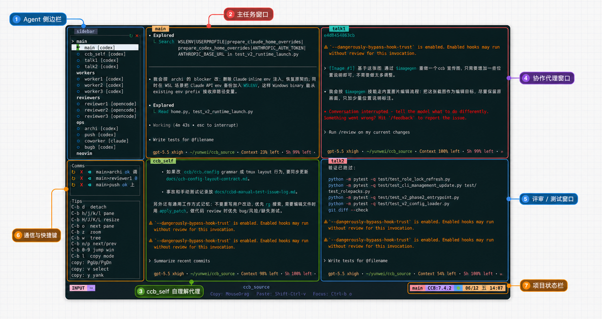
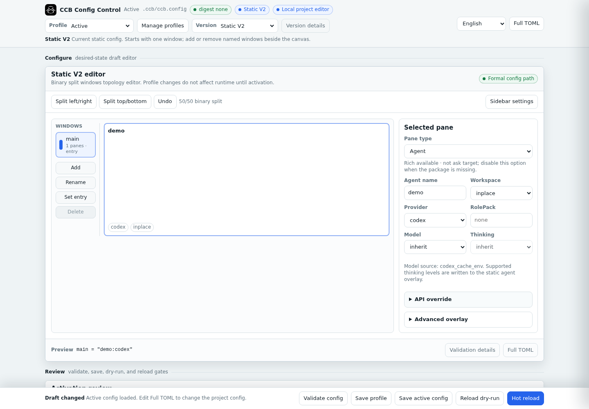
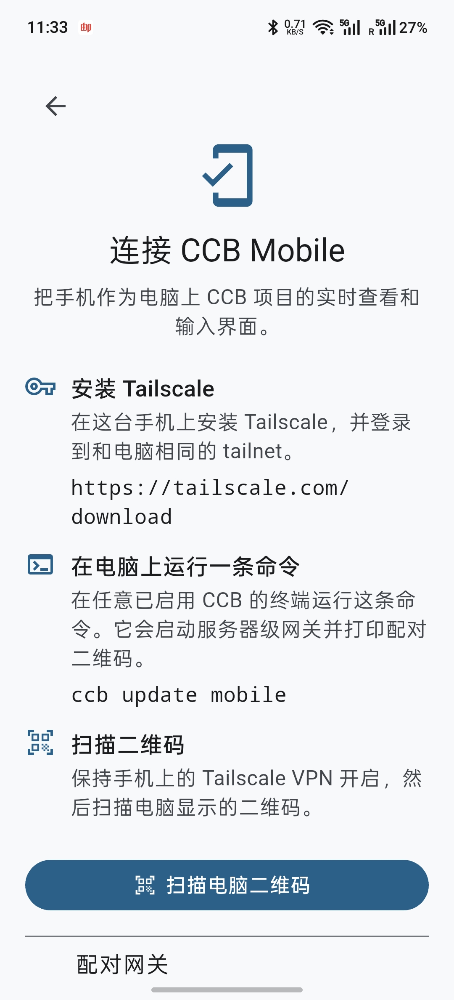
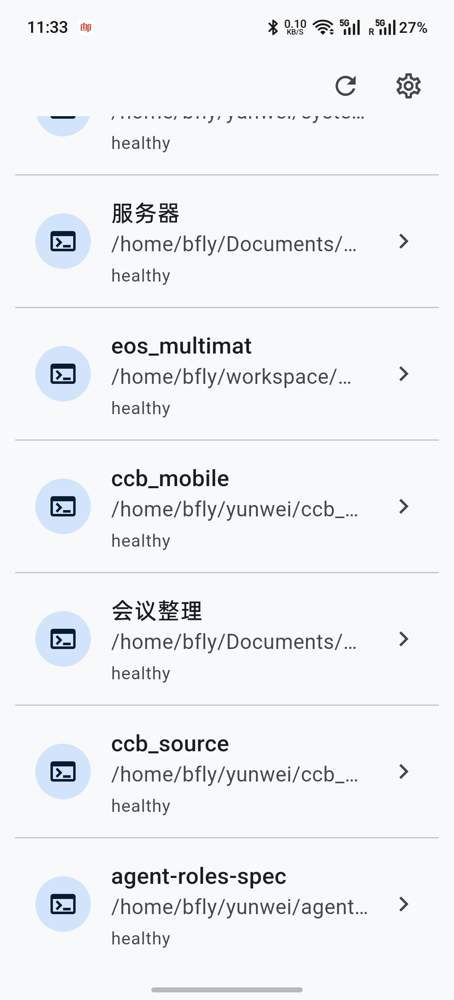
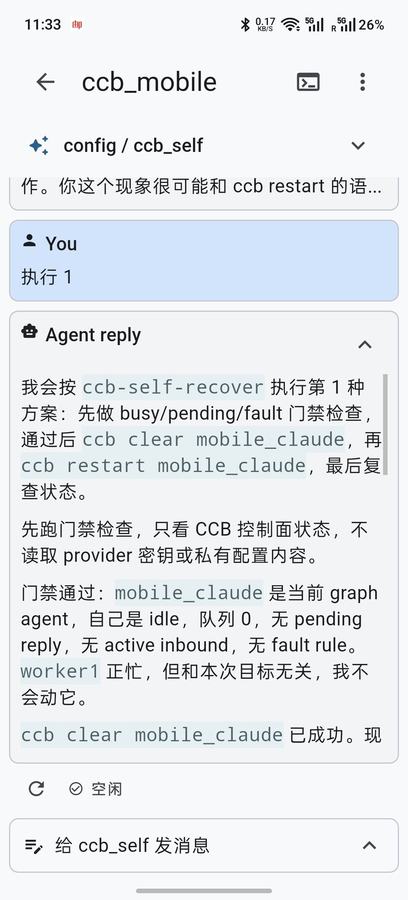
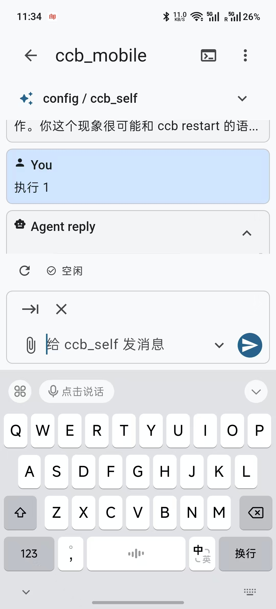
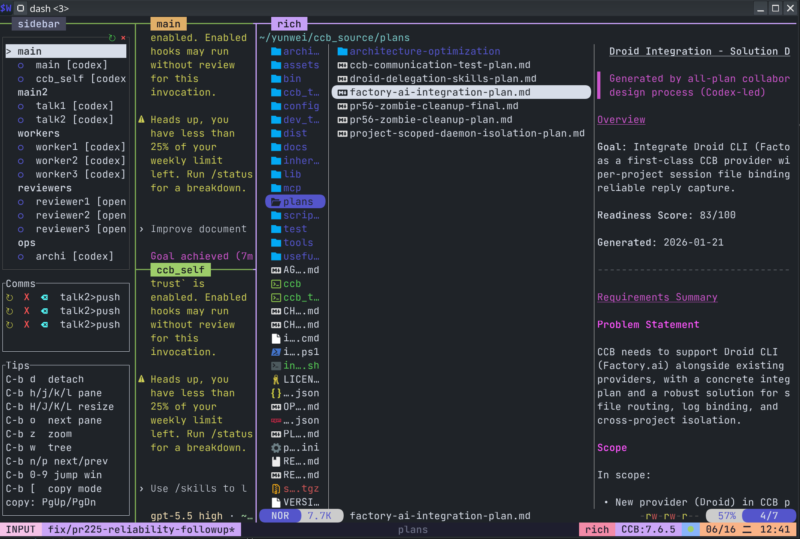

<div align="center">

# CCB 手机 App 来了！

**轻快的多 Agent TUI，稳定的跨 Provider 协作底座**<br>
**让 Codex、Claude、Gemini 等 CLI Agent 可见、可控、可接管地协同工作**

<p>
  
  
  
</p>

<p>
  
  
  
  
  
  
  
  
  
  
  
  
  
  
  
  
</p>

**中文** | [English](../README.md) | [日本語](ja.md) | [Français](fr.md) | [Deutsch](de.md) | [العربية](ar.md) | [Español](es.md) | [Português](pt.md) | [한국어](ko.md) | [Русский](ru.md)

[快速开始](#quick-start) · [Mobile App](#mobile-app) · [Rich 模式](#rich-mode) · [配置团队](#configure-agents) · [使用文档](../docs/manuals/user-guide/) · [开发文档](../docs/manuals/developer-guide/)

<p align="center">
  
</p>

</div>

<a id="why-ccb"></a>

## 为什么用 CCB？

- 强稳定的 agent 间通信能力，支持 `A -> B -> C`、`A,B -> C`、`A -> B,C` 等复杂协作关系。
- 每个 agent 都是完整原生终端，支持可见的界面排布和直接接管。
- 后台 daemon 持续运行，可以脱离前台界面保持项目状态。
- Hub 能力：一个命令同时并发运行多家 CLI provider。
- 手机远程控制器：跨 provider 语音操控、文件传输和远程终端访问。

<a id="how-to-install"></a>

## 如何安装

通过 npm 管理的 CCB 应继续使用 npm 安装或更新：

```bash
npm install -g @seemseam/ccb@latest
```

通过 GitHub release 包或源码安装时，使用 CCB 自带的事务 updater：

```bash
ccb update
```

在 npm 管理的安装中，`ccb update` 只会显示等价的 npm 命令，不会原地修改 npm vendored payload。

CCB 托管的 provider pane 会关闭已知的 provider 原生启动更新提示。更新 CCB
后，或者 CCB 已经是最新版时，`ccb update` 会统一检查已安装的 provider
CLI，并只提示一次可安全管理的更新。可使用 `--providers check`、
`--providers all` 或 `--providers none` 分别执行仅检查、非交互全部更新或
本次跳过。选择“暂不更新”后，下次 `ccb update` 会再次提示；选择“跳过此
版本”只会静默当前检测到的准确版本。该流程不会自动重启正在运行的
provider pane；已接受的新版本会在 pane 下次启动或显式重启后生效。

版本发生更新后，新安装的 CCB 还会迁移旧的项目级 Claude/Gemini 缓存：
manifest 校验通过且项目已经删除的缓存会立即清理；当前项目已经停止时会
立即清理，仍在运行或属于其他现存项目的缓存会保留到对应项目下一次成功
执行 `ccb kill` 后再清理。未知 Provider、损坏的 manifest、外来符号链接、
session/auth 和用户级 Gemini 缓存都不会被该迁移删除。单次更新可用
`ccb update --no-cache-cleanup` 跳过。

<details>
<summary><b>GitHub release 包和源码安装兜底</b></summary>

如果当前环境不方便使用 npm，可以到 [Releases](https://github.com/SeemSeam/claude_codex_bridge/releases) 下载与你的平台匹配的包，解压后安装：

```bash
tar -xzf ccb-*.tar.gz
cd ccb-*
./install.sh install
```

源码安装只建议开发或临时兜底使用：

```bash
git clone https://github.com/SeemSeam/claude_codex_bridge.git
cd claude_codex_bridge
./install.sh install
```

源码安装会让全局 `ccb` / `ask` 链接回当前 checkout。普通用户更建议使用 npm 包。

</details>

<a id="quick-start"></a>

## 快速开始

### 1. 启动

在工作目录执行：

```bash
ccb
```

如果启动时提示无法自动创建 `.ccb` 或找不到项目锚点，需要手动创建 `.ccb` 作为项目锚点：

```bash
mkdir -p .ccb
```

<a id="configure-agents"></a>

### 2. 配置工作台

空白项目现在会轻量启动：CCB 只打开一个 `main` window，并根据本机实际可用的 CLI（依次优先 Codex、Claude、Gemini，再到其他 provider）创建一个名为 `demo` 的 agent，不再默认挂载多 Agent 团队。

点击 CCB sidebar 左上角的 **⚙ 设置** 图标即可打开本地配置控制面；也可以在项目目录运行 `ccb config ui`。

#### 固化本地 Config UI 访问

Config UI 始终只绑定 loopback。若需要固定本地端口和 token，请在 `.ccb/ccb.config` 中配置 token 的**来源**，不要将 token 明文写入该文件：

```toml
[config_ui]
port = 43123
token_env = "CCB_CONFIG_UI_TOKEN"
# 或使用下面这一项替代 token_env：
# token_file = ".ccb/config-ui.token"
```

`--port` 仍可覆盖单次启动端口。`token_file` 必须是项目内相对路径、不能是符号链接，并且在 POSIX 上应仅允许文件所有者读取（`chmod 600 .ccb/config-ui.token`）。未配置 token 来源时，CCB 保持原有的随机 token 与临时端口行为。CLI 只输出 loopback URL 和 token 来源，不会输出 token 值。

<p align="center">
  
</p>

控制面可以配置 windows、pane 拆分、provider、模型、thinking 等级、API 覆盖、workspace、Rich 模式和 sidebar；保存前会先校验，并支持 reload dry-run 和受保护的热加载。保存后会生成 `.ccb/ccb.config`，将当前 provider 和拓扑固定为项目配置。

需要高级多 Agent 拓扑时，可以继续在控制面中可视化添加，或手动创建 `.ccb/ccb.config`。v2 `[windows]` 中的 `,` 和 `;` 分别控制 window 内的上下堆叠和左右分栏，例如 `A,B;C,D` 接近四宫格布局。

```toml
version = 2

[windows]
main = "main:codex"
work = "worker1:codex(worktree), worker2:claude(worktree)"
review = "reviewer:claude, qa:gemini"

[ui.sidebar]
mode = "every_window"
width = "15%"
bottom_height = 20
agents_height = "50%"
comms_height = "15%"
tips_height = "35%"
comms_limit = 3
```

验证配置并启动工作台：

```bash
ccb config validate
ccb
```

### 3. 开始协作

你可以直接在某个 agent pane 里输入，也可以让 agent 之间协作：

```text
/ask reviewer review the latest parser changes and list blocking issues.
```

也可以在工作编排中让 agent 自动调用 `/ask` 完成委派和交接。建议通过修改 agent 记忆或项目共享记忆 `.ccb/ccb_memory.md` 进行编排。

<a id="mobile-app"></a>

## 手机远程控制（Android）

推荐使用手机控制 CCB：可以接入所有 CCB 项目，控制每个 agent，语音输入，并传递文件。

```bash
ccb update mobile
```

该命令会指导你完成安装和配置。

<p align="center">
  
  
  
  
</p>

<details>
<summary><b>Mobile App 详情、安全边界和源码</b></summary>

CCB 8.5.7 已把 Flutter 版 CCB Mobile 源码放入 [`mobile/`](../mobile/)，并在 GitHub Release 中发布 Android APK：

- [下载 CCB Mobile v8.5.7 APK](https://github.com/SeemSeam/claude_codex_bridge/releases/download/v8.5.7/ccb-mobile-v8.5.7.apk)
- App 源码：[`mobile/app`](../mobile/app)
- 服务端 gateway 源码：[`lib/mobile_gateway`](../lib/mobile_gateway)

手机端定位是远程控制真实服务器上的 CCB 项目。它可以从 server-wide mobile gateway 获取所有已挂载项目，切换 window/agent，渲染 agent 对话上下文，以 pane-native 输入方式发送文本，打开 terminal 视图，并通过认证 gateway 上传/下载图片和文档附件。

安全边界：

- CCB gateway 默认绑定 loopback，例如 `127.0.0.1:8787`。
- 局域网直连时可绑定一个明确的私网网卡地址（拒绝通配地址和公网地址）：`ccb install mobile --route-provider lan --listen 192.168.31.155:8787`。配对 URL 会从 `--listen` 自动推导，无需额外转发进程或 `--public-url`。
- 远程访问使用 Tailscale Serve，不启用 Tailscale Funnel。
- CCB 不保存 Tailscale 密码、OAuth token、admin API token，也不会自动修改 tailnet ACL/grants。
- 手机只获得 pairing profile 授权的 scope，例如 view、content、terminal、file upload 和 file download。

</details>

<a id="rich-mode"></a>

## Rich 富媒体终端

在终端查看文件结构、打开文件、编辑文档和预览媒体内容。

<p align="center">
  
</p>

```bash
ccb update rich
```

rich 启用后，普通 `ccb` 会自动打开 rich WezTerm launcher，只有当当前已经处于 CCB 自己拉起的 rich WezTerm 中时才不会再次跳转；运行 `ccb uninstall rich` 可退回普通终端启动。

<a id="agent-roles"></a>

## Agent Roles Spec 规范和角色库

CCB 支持 [Agent Roles Spec](https://github.com/SeemSeam/agent-roles-spec)：这是一个 host-neutral 的专业 agent 封装规范，可把 skills、记忆和工具依赖打包成可安装、可挂载、可卸载的 Role Pack。该仓库同时也是公开角色库。

<details>
<summary><b>查看公开角色列表</b></summary>

| Role | 基本功能 |
| :--- | :--- |
| `agentroles.ccb_self` | CCB 自维护、配置辅助、运行诊断、受保护恢复和工作流编排。 |
| `agentroles.archi` | 架构审查、边界检查、耦合分析、可维护性风险和后续 gate 建议。 |
| `agentroles.frontend_engineer` | 前端设计与实现、设计系统、可访问性、浏览器 QA 和受审查的 AGY 委派。 |
| `agentroles.mobile_app_engineer` | iOS、Android、React Native、Expo、Flutter、SwiftUI、Jetpack Compose 等移动端设计与实现。 |
| `agentroles.mother` | Role 创建、Role source 审计、角色研究、蓝图设计和 Agent Roles 规范合规检查。 |
| `agentroles.su_ccb` | SU-CCB 工作流操作，覆盖需求分析、计划、派发、审查 gate、归档和恢复。 |

</details>

<a id="config-memory"></a>

## 配置和共享记忆

普通项目配置推荐直接使用左上角的 **⚙ 设置** 控制面。如果希望由 Agent 辅助设计配置或诊断运行状态，`ccb_self` 仍作为可选 Role Pack 提供，可以用 `ccb roles add agentroles.ccb_self:codex` 添加。

即使关闭可选 skill 继承，受支持的托管 Agent 也会获得内置 `ask`、`ccb-clear` 与 `ccb-diagnose` 控制 skill。使用 `$ccb_diagnose <agentname>` 可结合权威 runtime/job 状态和实时 Pane 证据诊断一个 Agent，在安全时执行受限恢复，并在明确授权提交 GitHub issue 前先审阅脱敏草稿。托管 Codex 还会保留 `reconnect`。

`.ccb/ccb_memory.md` 是项目级共享记忆文档，适合记录团队协作规则、项目约束、长期上下文和 agent 交接约定。把跨 agent 的稳定信息放在这里，比把同一段说明复制到多个 provider 私有记忆里更可靠。

<a id="contact"></a>

## 联系方式

- Email: `bfly123@126.com`
- [Telegram group & contact / TG 群与联系](https://t.me/+BKn03v8I_ehmYzRk)
- 微信: `seemseam-com`

<p align="center">
  
</p>

> 微信群二维码有效期为 7 天。如果二维码已过期，请添加微信 `seemseam-com` 获取最新入群邀请。

<a id="community"></a>

## 社区和致谢

感谢 [Linux.do 社区](https://linux.do) 在测试、反馈和讨论中的支持。

感谢 [tmux-agent-sidebar](https://github.com/hiroppy/tmux-agent-sidebar) 提供的 sidebar 思路和启发。

<a id="release-notes"></a>

## 新版本记录

<details open>
<summary><b>v8.5.7</b> - 内置 Agent 诊断与卡住投递恢复</summary>

- 所有受支持的托管 Agent 继续内置 `ccb-clear`，并新增必装的 `ccb-diagnose` Skill。运行 `$ccb_diagnose &lt;agentname&gt;` 可联合检查单个 Agent 的 daemon、lineage、队列、inbox、trace、Provider 日志和实时 Pane 证据。
- 可识别正常工作、等待输入、提示符停滞、Provider 错误、Pane 死亡/空白和布局不可观察等状态；只执行证据支持的有界控制面恢复，并在操作后重新验证 Agent。
- 诊断后可生成脱敏 incident 草稿，但创建 GitHub issue 前必须再次取得用户明确授权。
- 无需重放业务任务即可清理已遗弃的 mailbox 投递；sidebar 显示队列深度和当前 job 短码；Kiro 通过隔离的 `KIRO_HOME` 继承登录设置；Provider 无终态超时配置可传入 daemon，旧 Claude busy turn 记录不会污染新排队请求。
- reconnect 会探测当前 Codex Provider 的实际路由，让自定义 Provider 的容量或连接故障继续使用既有的受控恢复路径。

</details>

<details>
<summary><b>v8.5.6</b> - 连续继承 Provider 状态且不清除 CCB 对话</summary>

- 每个 API、token、URL、route 和账号维度都优先使用 CCB 配置；未显式配置的维度才从当前外部 Provider 状态单向读取。
- 停止后的 Provider 新 generation 会重新读取继承状态；不会反向写入用户 shell、Provider home、IDE、keyring 或远程登录。
- 权威 generation 变化时保留稳定的 CCB conversation、workspace、队列和历史。同一权威使用原生 resume；Codex/Claude/Gemini 在能力允许时执行 fork/import，否则记录 linked continuation，不隐藏历史。
- 可恢复受撤回版 v8.5.5 迁移形状影响的旧会话，不会执行 clear；撤回的 v8.5.5 包不再复用。
- CCB 托管 Codex 自动安装并 arm 内置 `codex-reconnect`；在精确 pane 和 thread 可证明安全时，网络中断或选定模型容量错误最多自动提交一次 `continue`。
- 新签发的 Relay Host 邀请默认配额从每 24 小时 200 MiB 提升到 1 GiB；显式覆盖值和现有凭据保持不变。
- 刷新微信社区群二维码和缓存 key；无需迁移配置或数据。

</details>

<details>
<summary><b>v8.5.5</b> - 已撤回的兼容性版本</summary>

- 该版本已于 2026-08-05 从 GitHub 撤回；旧会话迁移回归曾导致托管对话无法被原生 `resume` 找到。
- 托管会话请使用 v8.5.6 或 v8.5.4，不要安装 v8.5.5。

</details>

<details>
<summary><b>v8.5.4</b> - 更安全的 ask 路由、有界历史清理与可操作的 Mobile 局域网恢复</summary>

- 仅在真实依赖关系中使用 `--chain`：独立 ask、通讯测试、批量任务、通知和 reply-delivery 确认不再错误创建 callback chain。
- Config UI 支持按单个 Agent 或全部 Agent 扫描/清理历史，可选保留 7/30/90 天，并保护当前绑定、近期记录及每个 Provider 最新的一份 transcript。
- 当前 Config UI 聚焦配置和历史清理，暂时下架只读的通讯流观察区。
- Android 增加 LAN 配对预检、重连提示、重试/诊断操作和 15 秒 terminal WebSocket 心跳，且不会读取 SSID、BSSID 或其他网络身份信息。
- Flutter 静态分析和全部 736 个 App 测试通过；Android 真机 Wi-Fi/热点/VPN/DHCP 地址变化矩阵仍是明确的验证限制。

</details>

<details>
<summary><b>v8.5.3</b> - 更高 Relay 配额、有界 callback 修复与完整 Claude Agent 环境变量</summary>

- 新签发的 Relay Host 邀请默认配额从每 24 小时 100 MiB 提升到 200 MiB；运营端显式指定的配额仍然优先。
- 缓存 callback edge 的最新状态并限制修复候选，避免历史追加日志导致空闲 daemon 持续高 CPU 和缓存读放大。
- 将 `agents.&lt;name&gt;.env` 中的非 API 变量传入托管 Claude，同时保留 CCB 对 API 凭据和 endpoint 的优先级控制（PR #284）。
- 已有 Relay Host 凭据继续保留签发时的配额；运营端需要单独更新或重新签发邀请。

</details>

<details>
<summary><b>v8.5.2</b> - 有界 pane 恢复、更简练的 ask 与隔离的 Rich 终端启动</summary>

- respawn 后进入 90 秒观察期，只有新的健康观测确认恢复后才会继续派发队列任务。
- 不稳定恢复依次退避 30s/60s/120s/5m/10m/30m，第六次后打开熔断，不再无限重启和写盘。
- 每个 Provider runtime 只保留最新 50 份 pane crash 记录，清空旧 pane history，并跳过内容未变化的 helper manifest 写入。
- 只修复失效的 CCB 托管 Claude continuation 状态且不改登录信息；托管 Codex app server 不可用时安全停止。
- 把稳定的回复与取消规则放入托管项目记忆，普通 ask 不再重复注入提示段落，也不要求每一步轮询取消文件。
- CCB Rich WezTerm 与父 TTY 完全分离，并提供私有 Wayland XCursor overlay，同时保留用户选择的 cursor theme。

</details>

<details>
<summary><b>v8.5.1</b> - 完整 Claude 回复、可见 Pi 执行与不受代理干扰的 Mobile 健康检查</summary>

- 按 assistant message 聚合 Claude 快照，只有 thinking 的边界和工具过程说明不会再替代真实最终回复。
- Claude completion hook 缺失时只使用与请求、Agent、workspace、时间和 session 精确匹配的证据恢复；mid-stream stalled 响应会安全失败。
- 新 Pi ask 在托管可见 pane 中执行，并且只从精确绑定的 `agent_settled` 消息完成。
- Pi 长任务默认不再受固定终态超时限制，同时移除会产生额外工具调用和非缓存 token 的模型侧 cancel-file 检查。
- 保持对 8.5.0 已持久化 Pi job 和显式 `CCB_PI_EXECUTION_MODE=headless` 回滚路径的兼容。
- 本地 Mobile gateway 健康检查绕过已配置的 HTTP 代理。

</details>

<details>
<summary><b>v8.5.0</b> - 精确 Pi/OMP 终止、自修复 npm 运行时、同步 Mobile 活动与更安全的托管资源</summary>

- 将 Pi 完成信号绑定到最新的 `agent_settled`，将 OMP 完成信号绑定到 `agent_end.isTerminal=true`，并在进程退出且输出关闭后才进入终态。
- 对缺少原生终止证据、缺少最终结果、JSONL 损坏或截断、Provider 错误和非零退出安全拒绝；OMP 的终态 `yield` 仍作为受支持的成功结果。
- 安装时自动创建并修复 npm 托管 Python 环境，正式版运行依赖不再依靠不完整的系统 Python 兜底；linked Git worktree 仍会被正确识别为源码安装。
- 让 sidebar 设置入口能够恢复正式版受管运行时，并可靠打开 Config UI。
- 将 Mobile 的 ask/Provider 活动与服务端精确状态同步，稳定完成通知，并隐藏自动重连过程中的无意义提示。
- 收紧托管 Provider 资源的单向投影边界，并加入内置 Qoder 控制技能，托管侧不会获得改写用户全局状态的通道。

</details>

<details>
<summary><b>v8.4.3</b> - Provider 认证隔离、必备控制技能与可靠的 Mobile 配对和终端恢复</summary>

- 将可变认证、账号、session 和存储状态隔离到每个托管 Provider 的私有 home，visible 与 headless 执行使用同一边界。
- 外部凭据只作为单向继承来源，托管 Provider 的刷新或退出不会改写用户 shell、IDE、其他 Agent 或其他项目的登录态。
- 即使关闭可选 skill 继承，也会为受支持的托管 Agent 提供内置 `ask` 与 `ccb-clear`；托管 Codex 还会保留 `reconnect`。
- 可选 skill 改为逐项投影，一个损坏的外部条目不会阻断 CCB 控制技能或其他有效 skill。
- 新增经过校验的紧凑 Relay 配对二维码，可放入 97 列终端，同时保留仅所有者可读的 PNG 兜底。
- 通过同步 snapshot、完整重绘和自动更新 terminal handle，修复 Mobile 终端 resize 与流错误恢复竞态。

</details>

<details>
<summary><b>v8.4.2</b> - Config UI 主题持久化、Relay 终端稳定传输与安全 Provider 更新</summary>

- 即使 sidebar 继承到失效 Python 路径，也会使用正式版受管解释器打开 Config UI。
- 新增可持久化的 CCB 主题选择，包括跟随系统，并在 Config UI、Rich WezTerm 与 sidebar 重启后保持一致。
- 通过有界背压、稳定快照、增量更新和宽字符计算加固 Relay 终端流。
- 密集配对内容无法在当前终端安全显示时，生成仅所有者可读的 PNG 二维码。
- Provider 更新保持 npm/NVM 与 Bun 的包管理器所有权。
- 对不可写系统安装和解析到本地依赖的异常 Registry 版本只报告、不更新。

</details>

<details>
<summary><b>v8.4.0</b> - 加密 Mobile Relay、简化配对、稳定项目身份与 Codex 重连</summary>

- 新增端到端加密的 CCB Mobile Relay，支持运营方签发的一次性邀请码、有边界的接入控制、多路复用流，以及官方或自建 Relay 两种部署方式。
- 将路由选择收敛到 `ccb update mobile`：电脑端可选 Tailscale、经过校验的局域网私网地址、CCB Relay 或自建 Relay，手机端只需扫码或输入配对码。
- 新增可信的 Android 应用内更新流程；交给系统安装前，会校验 GitHub 官方 Release 元数据、APK 大小和 SHA-256。
- CCB 项目移动或改名后仍保持稳定身份，并让终端和配置界面支持跟随系统的浅色/深色主题。
- 将可选的 Codex reconnect 监督集成到托管 home；保留有边界的终端错误证据，并在 pane 或 session 不匹配时拒绝恢复。
- Relay 数据保持端到端加密；Relay 运营方只能看到连接元数据，不能读取任务提示、回复、终端内容或传输文件。

</details>

<details>
<summary><b>v8.3.1</b> - 统一 Provider 更新、安全回收缓存与持久化 Config UI 访问</summary>

- 将受支持的 Provider 升级统一到 `ccb update`，提供准确版本检查、暂不更新和精确版本跳过，并且不会自动重启运行中的 pane。
- 废弃项目级 Claude/Gemini 软件缓存，改用用户安装的 Claude 可执行文件和一份用户级 Gemini 缓存。
- 增加有边界的更新后与关闭后清理，保留运行中的项目、未知内容、session、认证数据和用户自有缓存。
- 支持固化 Config UI 的 loopback 端口与受保护的 token 来源，同时不暴露 token 值。
- 新增原生 Qoder CLI CN 支持，隔离配置与 session 状态，并修正 Qoder 的 `--print` / `--config-dir` 执行协议。
- 在服务停止阶段继续可靠执行 shutdown finalizer，并让 sidebar 发布校验和生成兼容不同主机。
- 将 Rich 模式切换为紧凑的 Yazi 双栏布局，并把所有发布面同步到 8.3.1。

</details>

<details>
<summary><b>v8.3.0</b> - 精确 Provider 回合、作业完整性与项目内 Mobile 终端</summary>

- 将 Kimi、Claude 和 Qoder 执行绑定到各自原生的回合、激活、会话和完成协议。
- 增加精确 active job follow-up、关联执行阶段、孤立 inbound 诊断和终态取消结果。
- 以明确的投影资源所有权保护继承 Provider 扩展与 Copilot 插件。
- 将 npm 管理安装的升级交还 npm，并保守回收仅含标记的 worktree。
- 让 Mobile 的聊天和终端模式留在所选项目工作区，并将所有发布面统一到 8.3.0。
- 修复 WSL 与 macOS 上 sidebar 设置按钮无响应的问题：优先使用原生浏览器打开方式、刷新桌面会话环境，并在自动打开失败时明确提示手动打开。

</details>

<details>
<summary><b>v8.2.1</b> - 确定性启动、可操作的认证恢复与 Android 后台连接</summary>

- 增加端到端启动代际栅栏、有限就绪证明，以及启动操作量和时间线诊断。
- 对不可恢复的 Provider 认证失败停止无效重启，并通过 ping、project view 和 sidebar 显示登录操作。
- 在更严格的 lifecycle 权威模型下保持增量 reload 身份校验和 shutdown 幂等行为。
- 增加用户主动启用的 Android 后台连接控制，并保证每个 Agent 只保留一个 working reply 状态。
- 将 Linux、macOS、npm 和签名 Android APK 的版本统一到 8.2.1。

</details>

<details>
<summary><b>v8.2.0</b> - 启动提速、Provider 修复与 Mobile 稳定性</summary>

- 减少 ccbd 启动关键路径的重复工作，同时保留 lifecycle 和 ownership 校验。
- 修复 Grok fullscreen 启动冲突、Claude 凭据类型保持，以及 Config UI 模型和思考强度保存后退回继承值的问题。
- 保持 Codex ask 传输与目标 session 绑定，并阻止已接受的空传输确认被无限重新排队。
- 改进 Mobile 恢复、对话和终端交互、图片/文档/视频附件、主机文件下载与设备绑定 FCM 推送。
- 将 Linux、macOS、npm 和签名 Android APK 的版本统一到 8.2.0。

</details>

<details>
<summary><b>v8.1.6</b> - 已撤回</summary>

- 已被后续版本替代，详细说明不再保留。

</details>

<details>
<summary><b>v8.1.5</b> - 已撤回</summary>

- 该版本已撤回并被替代，详细说明不再保留。

</details>

<details open>
<summary><b>v8.1.4</b> - Codex subagent 隔离与 Grok 原生 skills</summary>

- 阻止 Codex 原生 subagent rollout 抢占 CCB 请求绑定，也不能替换权威父会话和父 turn。
- 内置 subagent 的活动、消息和完成事件只留在父 agent 的协作流程内，不再返回给 CCB caller。
- Python runtime 与 Rust accelerator 使用相同隔离规则，并通过真实登录态 `spawn_agent` 回归确认 caller 只收到父 agent 最终回复。
- 为每个受管 Grok home 独立注入原生 `ask` 与 `ccb-clear` skills，并且只开放这两个命令所需的精确权限。
- 启动前刷新继承的系统 Grok 登录态，并通过每个 agent 的可见原生 Grok 会话处理 CCB 请求；双 Grok 真实测试已通过可见 ask、结果回收、指定目标 clear 和 clear 后隔离验证。

</details>

<details open>
<summary><b>v8.1.3</b> - Mobile 交互可靠性与 Grok 完成判定</summary>

- 合并流式回复到同一个工作气泡并保持气泡元素身份，避免对话刷新闪烁、重复消息和错误的工作中状态。
- 刷新期间稳定保留 agent/window 选择，保留 pane 真实 terminal scrollback，并要求用户明确激活键盘后才发送 terminal 输入。
- Android 配对改用内嵌 ML Kit 扫码器，并确保 release 混淆后相关类仍被保留。
- 过滤 Codex 本地控制 transcript 条目，并要求 Grok 提供原生 turn-completion 证据后才结束托管请求。

</details>

<details>
<summary><b>v8.1.2</b> - Mobile 对话可靠性与安装器证书恢复</summary>

- 加固 Mobile invalidation 恢复、快照、实时对话刷新、附件回显合并和任务完成通知。
- 恢复展开消息滚动与项目文件链接，简化 terminal 快捷键、压缩控制栏，并移除重复 terminal 标题。
- 复用的托管 Python 环境会刷新旧版 pip 以获得系统证书支持，并且只在 truststore 后端实际可用时启用。
- 扩展 macOS DNS、代理、超时和证书错误的 HTTPS 镜像重试识别，不关闭 TLS 校验。

</details>

<details>
<summary><b>v8.1.1</b> - Mobile 实时恢复与 macOS 安装稳定性</summary>

- Mobile gateway 新增有界 SSE invalidation 流，项目、活动和对话变化可刷新权威状态，不再依赖活跃页面轮询。
- 新增有界只读快照、重连状态和自动恢复；gateway 中断期间保留所选 host、项目、agent、近期对话及完成通知。
- Mobile host 启动时可识别并安全接管匹配的旧 gateway 进程，避免升级期间出现重复监听。
- macOS release 更新会保留健康的托管 Python 环境，并在 TLS 或网络失败后通过可配置镜像重试安装 `watchdog`。

</details>

<details>
<summary><b>v8.1.0</b> - 配置控制面与轻量默认工作台</summary>

- 新增可视化项目配置控制面，可通过 sidebar 左上角的 **⚙ 设置** 或 `ccb config ui` 打开，支持配置校验、差异审查、保存、reload dry-run 和受保护的热加载。
- 空白项目现在只挂载一个名为 `demo` 的 agent，并自动选择本机首个可用 CLI；显式项目配置和用户配置仍可定义任意单 Agent 或多 Agent 拓扑。
- 新增 Grok CLI 托管支持、Kimi Code v0.23.1 readiness 兼容、OpenCode fresh session 修复，以及 Claude/Gemini hook launcher 可靠执行。
- 改进 CCB Mobile gateway profile 持久化、配对凭据保留、项目健康缓存、列表预热显示和 terminal UI 效率。
- 多语言 README 统一整理到 `README/`，加入真实配置控制面截图，并将 package、Mobile、workflow 和 release metadata 对齐到 8.1.0。

</details>

<details>
<summary><b>v8.0.19</b> - Mobile host 启动健康检查修复</summary>

- `ccb update mobile` 对 server-wide loopback `/v1/health` 使用更宽松的单次请求超时和总启动等待窗口，避免挂载项目较多时误判后台 gateway 不健康。
- 新增 regression test 覆盖健康响应晚于旧 0.5 秒请求超时时仍应启动成功。
- `ccb update mobile` 默认 APK 下载链接、README、package metadata 和 mobile app version metadata 对齐到 8.0.19。

</details>

<details>
<summary><b>v8.0.18</b> - Codex auth 投影与 Mobile host health 修复</summary>

- Codex managed `CODEX_HOME` materialize 阶段会同步 `auth.json`、`config.toml`、`company-codex-api-key`、`company-codex.config.toml`，以及 `config.toml` 中引用到的安全 auth/key/token sidecar 文件名。
- 新增 `.ccb-auth-projection.json` 证据 manifest，只记录来源/目标存在性、大小和 SHA256，不保存密钥明文。
- 显式 Codex API authority 会清理继承来的 auth sidecar，避免全局登录态和 agent-local API 配置混用。
- WSL 下 Codex 解析到 Windows interop 可执行文件时，`ccb doctor` 会标记 `reason=wsl_windows_interop_executable`。
- server-wide mobile 项目发现会容忍 stale project 记录，避免单个失效项目拖垮整体列表。
- README 角色列表改为折叠显示，并更新联系方式中的微信图片。
- `ccb update mobile` 默认 APK 下载链接、README、package metadata 和 mobile app version metadata 对齐到 8.0.18。

</details>

<details>
<summary><b>v8.0.17</b> - Ask 回复稳定性与 Mobile 更新修复</summary>

- Codex ask 回复检测改为基于无进展时间，长 session 文件持续写入时不会按提交时间误失败。
- 官方 session/log 缺失时返回可诊断的非成功状态，避免 silent stuck；明确 shutdown 时标记为 provider crashed。
- Mobile frontdesk 消息提交改走 ccbd ask job，不再直接写 pane。
- `ccb watch` 默认不再 10 秒超时，`ccb update mobile` 等长等待路径可以等到真实终态；显式 `CCB_WATCH_TIMEOUT_S` 仍会生效。
- `ccb update mobile` 默认 APK 下载链接、README、package metadata 和 mobile app version metadata 对齐到 8.0.17。

</details>

<details>
<summary><b>v8.0.16</b> - Mobile 重连与 pane 活动记录</summary>

- CCB Mobile Terminal 模式增加自动重连诊断与恢复路径，断线时会显示 Reconnecting，并在恢复后继续使用当前 agent pane。
- mobile gateway 在 pane 输入路径记录项目活动，保证 mobile 项目列表最近使用排序能感知 Terminal 输入。
- `ccb update mobile` 默认 APK 下载链接、README、package metadata 和 mobile release manifest 对齐到 8.0.16。

</details>

<details>
<summary><b>v8.0.12</b> - Release CI 可移植性与 README 多语言同步</summary>

- mobile host registry 测试现在把临时 Unix socket 放到短的 `/tmp/ccb-sock-*` 路径，避免 macOS CI 触发 `AF_UNIX path too long`。
- `ccb update mobile`、README 链接、package metadata 和 mobile release manifest 对齐到 8.0.12 APK。
- v8.0.12 引入了结构一致的多语言 README；当前多语言文件统一放在 [`README/`](./) 目录，中文版本为 [`zh.md`](zh.md)，根目录 `README.md` 为英文首页。

</details>

<details>
<summary><b>v8.0.0</b> - CCB Mobile Monorepo 发布</summary>

- Flutter 版 CCB Mobile 源码正式进入本仓库，并在 GitHub Release 中发布 Android APK。
- 新增 server-wide mobile 项目发现、配对、认证 gateway 路由、pane-native 消息输入、对话上下文渲染、terminal 访问，以及图片/文档上传下载能力。
- 将 `ccb update mobile` 提升为 Tailscale Tailnet onboarding 的统一入口，同时保持 gateway 仅监听 loopback，不启用 Funnel、不保存 token、不自动修改 ACL/grants。

</details>

<details>
<summary><b>v7.7.0</b> - Runtime Accelerator 发布加固</summary>

- Release artifacts 现在会携带可选 Rust `ccb-runtime-accelerator`，安装版 Codex agent 在预期存在 sidecar 时不再静默退回 Python 热路径。
- 当项目路径导致 Unix socket 路径过长时，accelerator socket 会自动落到短的 per-user runtime socket root。
- 加固 callback repair 和 Codex binding cache invalidation，并记录完整回归、长 idle Codex soak、Claude callback 和混合 provider 集成测试证据。

</details>

<details>
<summary><b>v7.6.19</b> - 长任务 ask 默认等待策略</summary>

- 普通长时间 `ask` 默认继续等待真实 provider/completion 结果，不再仅因 heartbeat 诊断自动 terminalize 为 `incomplete/heartbeat_timeout`。
- Codex、Claude、Gemini 的 pane-backed no-terminal timeout 默认改为显式 opt-in，仍保留显式 reliability timeout 策略。
- 已用 32 分钟 source-runtime ask smoke 验证：任务超过 30 分钟仍保持 running，随后以 `result_message` 完成，未出现 `heartbeat_timeout` 或 `incomplete` 证据。

</details>

完整历史请看 [CHANGELOG.md](../CHANGELOG.md)。
