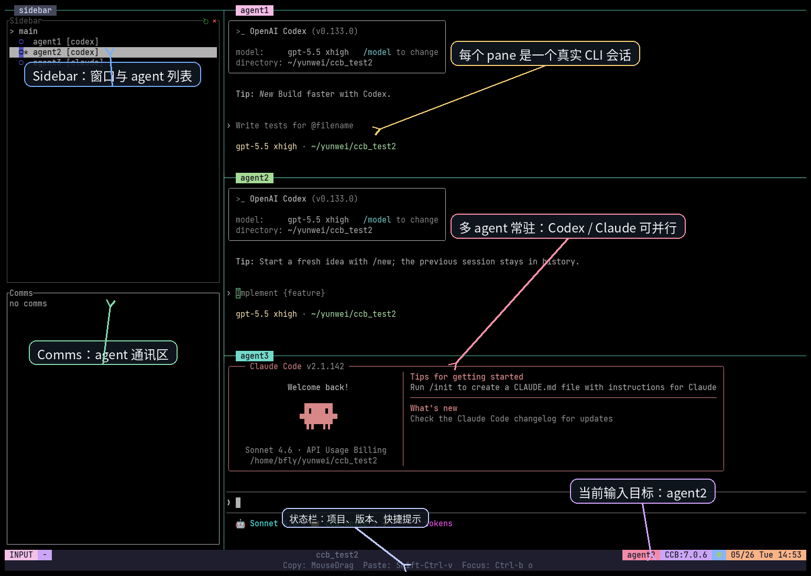

<div align="center">

# CCB - 可见、可控的多 Agent CLI 工作台

<p>
  
  
  
</p>

[]()
[]()
[]()
[]()

**中文** | [English](README.md)

[为什么需要多 agents](#为什么需要多-agents) · [方案对比](#多-agents-方案怎么选) · [v7 界面](#v7-界面速览) · [快速开始](#快速开始) · [tmux 常规操作](#tmux-常规操作) · [配置团队](#配置-agent-团队) · [安装更新](#安装和更新)

</div>

---

## 为什么需要多 agents

小任务用单 agent 就够了；一旦任务需要规划、并行实现、审查、测试和交接，多 agents 的价值就变成：把角色、上下文、模型和执行过程拆开管理。CCB 的重点是把多个真实 CLI agent 放进同一个可见终端工作台。

| 价值 | 直观理解 |
| :--- | :--- |
| 角色分离 | `main` 负责任务拆分，`worker` 负责实现，`reviewer` 负责审查。 |
| 并行推进 | 一个 agent 写代码时，另一个 agent 可以读文档、跑验证或审查风险。 |
| 模型和上下文分层 | 不同 agent 可以用不同 provider、model、API、worktree 和记忆。 |

<details>
<summary><b>展开：单 agent 为什么会吃力？</b></summary>

- 角色混杂会影响上下文集中度：同一个会话既要做架构，又要写代码，还要自我审查，容易在长任务里丢掉重点。
- 可执行复杂度有上限：任务越长，越需要拆分、交接、核对和回滚点。
- 成本压力更高：如果所有步骤都依赖一个最强模型，简单任务也会变贵。
- 工具和 skill 集中会变难管理：什么都给一个 agent，等于把权限、说明和工具复杂度全部堆在一起。
- 串行等待效率低：一个 agent 在跑测试、读日志或长时间思考时，其他可并行工作无法自然展开。

</details>

## 多 agents 方案怎么选

多 agents 不是一种固定形态。先用下面这张表判断大方向，细节可以展开看。

| 方案 | 一句话 | 更适合你如果 |
| :--- | :--- | :--- |
| [Claude Code 原生 subagents](https://code.claude.com/docs/en/sub-agents) / [agent teams](https://code.claude.com/docs/en/agent-teams) | Claude Code 内部的原生分工。 | 你主要留在 Claude Code，并接受更多协调由 Claude lead 处理。 |
| [Hive / OpenHive](https://github.com/aden-hive/hive) | 面向生产工作流的多 agent harness。 | 你要状态、恢复、观测、成本控制和图式工作流。 |
| CCB | 可见、可控、混合 provider 的本地 CLI agent 工作台。 | 你要把 Codex、Claude、Gemini、OpenCode、Antigravity 等真实 CLI 放到一个项目终端里操作。 |

<details>
<summary><b>展开：模型、可控性、上下文和复杂工作流怎么区别？</b></summary>

| 关键问题 | Claude Code 原生 | Hive / OpenHive | CCB |
| :--- | :--- | :--- | :--- |
| 能否使用不同家的模型 | 可给 teammate / subagent 指定 Claude 模型；整体仍在 Claude Code 体系内。 | 通过 LiteLLM 路线支持大量 hosted / local provider。 | 按 agent 选择 Codex、Claude、Gemini、OpenCode、Droid、Antigravity 等，并可设置独立 model / key / url。 |
| 过程是否可见 | in-process 或 split panes，取决于模式和终端。 | 强调 runtime observability 和控制台视角。 | 默认就是 tmux 可见 pane，用户能直接点击、输入、复制、观察每个 CLI。 |
| 拓扑是否可控 | 可自然语言指定队友，但运行时协调较多交给 lead。 | 由目标生成图式拓扑，偏 harness。 | 配置文件显式定义 agent、窗口、pane、worktree 和 sidebar。 |
| 上下文是否可管理 | subagent / teammate 有独立上下文；team 有任务和消息状态。 | 角色记忆、状态持久化、恢复能力是核心卖点。 | 每个 CLI 保留自己的 provider 会话；项目共享记忆和 per-agent 记忆可选。 |
| 最适合的落点 | Claude Code 内部的快速委派和团队模式。 | 业务流程自动化、长期运行和生产可靠性。 | 本地开发、代码协作、跨 provider CLI agent 可视化工作台。 |

CCB 也支持复杂工作流，但它不是自动生成 DAG 的 harness；复杂度主要通过 `.ccb/ccb.config`、多 window、角色记忆、worktree、model/API 配置和 ask/callback 路由显式设计。

</details>

## CCB 是什么

> **名称演变**：CCB 最初代表 "Claude Code Bridge"。随着项目扩展到支持多模型（Codex、Claude、Gemini、OpenCode、Kimi、Droid、MMX），这个缩写现在代表 **"Collaborative Code Bridge"** —— 一个让多个 CLI agent 协作的项目级工作台。

CCB 是一个项目级 agent CLI 工作台。它用 tmux 管理多个真实 CLI agent，把启动、恢复、通信、配置、窗口和运行态聚合在一个项目里。

- **真实 CLI，不是模拟面板**：每个 agent pane 都运行对应 provider 的真实 CLI。
- **可见协作**：sidebar 展示窗口、agent 状态和通信区；用户可以用鼠标直接切 pane。
- **混合 provider**：一个项目里可以同时跑 Codex、Claude、Gemini、OpenCode、Droid 和 Antigravity（`agy`）。
- **项目级配置**：`.ccb/ccb.config` 决定团队、布局、窗口、worktree、model、key、url。
- **Roles**：全新的角色封装概念；它让携带“重武器”（独立 skills、记忆和
  工具依赖等）的专业角色瞬间“降临”到目标项目中，成为一个可以快速热加载和
  卸载的独立 agent，同时保持主环境、用户全局配置和项目运行状态不发生改变。
- **可恢复运行态**：CCB 后台守护 agent pane，支持 attach、恢复和项目级清理。
- **显式协作通道**：agent 可以通过 `/ask`、`$ask`、callback 和 silence 进行委派与交接。

## v7 界面速览

下面截图来自 `ccb_test2` 项目的真实深色终端会话。图片上的标注只解释区域，不代表必须记住所有快捷键。

<p align="center">
  
</p>

| 区域 | 作用 |
| :--- | :--- |
| Sidebar | 显示当前 window、agent 列表、provider 标签、当前选中 agent 和状态提示。 |
| Comms | 显示 ask/callback 等协作消息和通信状态。 |
| Agent pane | 每个 pane 是一个真实 CLI 会话，例如 Codex 或 Claude。 |
| 当前输入目标 | 状态栏和 pane 边框会提示当前输入会发给哪个 agent。 |
| 状态栏 | 显示项目名、当前 agent、CCB 版本、日期和常用鼠标/键盘提示。 |
| Window 分组 | v7 可用 `[windows]` 把 agent 按 main、work、review、research 等窗口分组。 |

Sidebar 相关实现使用并借鉴了 [tmux-agent-sidebar](https://github.com/hiroppy/tmux-agent-sidebar) 的思路，在此表示感谢。

## 快速开始

### 1. 安装或更新

新用户优先使用 release 包。到 [Releases](https://github.com/SeemSeam/claude_codex_bridge/releases) 下载与你的平台匹配的包，解压后安装：

```bash
tar -xzf ccb-*.tar.gz
cd ccb-*
./install.sh install
```

如果你已经装过 CCB：

```bash
ccb update
```

<details>
<summary><b>源码安装只建议开发或临时兜底使用</b></summary>

```bash
git clone https://github.com/SeemSeam/claude_codex_bridge.git
cd claude_codex_bridge
./install.sh install
```

源码安装会让全局 `ccb` / `ask` 链接回当前 checkout。普通用户更建议安装或更新到稳定 release。

</details>

### 2. 创建项目配置

在项目根目录创建 `.ccb/ccb.config`。v7 推荐直接从多 window 拓扑理解配置：`[windows]` 定义窗口和 agent 分组，`agent:provider` 定义每个 agent 使用哪家 CLI，`(worktree)` 表示该 agent 使用独立 git worktree。

```toml
version = 2
entry_window = "main"

[windows]
main = "main:codex"
work = "worker1:codex(worktree), worker2:claude(worktree)"
review = "reviewer:claude, qa:gemini"

[ui.sidebar]
mode = "every_window"
width = "15%"
bottom_height = 20

[ui.sidebar.view]
agents_height = "50%"
comms_height = "15%"
tips_height = "35%"
comms_limit = 3
```

如果你不确定应该如何分组、要几个 worker、哪些 agent 用 worktree、哪些 agent 需要独立模型或 API，可以让 `ccb_self` 使用它内置的 `ccb-config` 和你讨论并生成配置方案。空白项目默认包含 `ccb_self`；已有自定义配置可用 `ccb roles add agentroles.ccb_self:codex` 添加。

验证配置：

```bash
ccb config validate
```

启动工作台：

```bash
ccb
```

### 3. 开始协作

你可以直接在某个 agent pane 里输入，也可以让 agent 之间协作：

```text
/ask reviewer review the latest parser changes and list blocking issues.
```

## 日常操作

| 目标 | 命令 |
| :--- | :--- |
| 启动或重新 attach 当前项目工作台 | `ccb` |
| 安全启动，保留各 agent 配置的权限策略 | `ccb -s` |
| 重建运行态，保留配置和同名 managed agent 历史 | `ccb -n` |
| 停止当前项目后台 | `ccb kill` |
| 强制清理当前项目残留后再重建 | `ccb kill -f` 后接 `ccb -n` |
| 更新到最新稳定 release | `ccb update` |
| 查看当前使用的配置层 | `ccb config validate` |
| 预览配置热加载计划，不修改 tmux | `ccb reload --dry-run` |
| 应用支持的配置变更，不重启其他 agent | `ccb reload` |

## tmux 常规操作

CCB 虽然基本全部可以使用鼠标操作，但是学会 tmux 命令可以显著增加便利性。下面列举了部分常用的键盘操作快捷键。

本节只讲 tmux。下面的 `<prefix>` 默认为 `Ctrl-b`：**先按 `Ctrl-b`，松开，再按后面的功能键**。功能键建议在英文输入法下按，避免中文输入法拦截符号键。

| 目标 | 功能键 | 说明 |
| :--- | :--- | :--- |
| 切换到相邻 pane | `方向键` | 选择上、下、左、右相邻 agent pane。 |
| 切到下一个 pane | `o` | 不关心方向时快速轮转。 |
| 放大 / 还原当前 pane | `z` | 看长输出、diff、日志时非常有用。 |
| 打开 window / pane 列表 | `w` | 在多 window、多 pane 时选择目标。 |
| 下一个 window | `n` | 切到下一个 tmux window。 |
| 上一个 window | `p` | 切到上一个 tmux window。 |
| 切到编号 window | `0` 到 `9` | 直接跳到对应编号的 window。 |
| 进入复制/滚动模式 | `[` | 查看历史输出、滚动、选择文本。 |
| 退出复制/滚动模式 | `q` 或 `Esc` | 回到正常输入。 |
| 粘贴 tmux buffer | `]` | 粘贴 tmux 自己复制的内容。 |
| 暂时 detach 会话 | `d` | 退出显示但不停止 CCB 后台，会话仍可重新 attach。 |

复制粘贴建议：

- **鼠标复制**：大多数终端里可以直接左键拖选复制；如果拖选被 tmux 接管，先进入复制/滚动模式再选择。
- **绕过 tmux 拖选**：很多终端支持 `Shift + 鼠标拖选` 使用终端原生复制。
- **系统粘贴**：Linux/Windows 终端通常是 `Ctrl+Shift+V`，macOS 终端通常是 `Cmd+V`。
- **tmux 粘贴**：如果内容已经在 tmux buffer 里，用功能键 `]`。

<details>
<summary><b>更多常用 tmux 操作</b></summary>

| 目标 | 功能键 | 说明 |
| :--- | :--- | :--- |
| 在复制/滚动模式中滚动 | `PageUp` / `PageDown` / `方向键` | 不同终端支持略有差异。 |
| 在复制/滚动模式中搜索 | `Ctrl-s` / `Ctrl-r` | 分别常用于向前/向后搜索。 |
| 新建 window | `c` | 只在你明确需要额外 shell 时使用。 |
| 重命名 window | `,` | 多 window 工作流中更容易识别。 |
| 显示快捷键帮助 | `?` | 忘记快捷键时查看 tmux 帮助。 |

不建议新用户一开始就使用关闭 pane/window 的 tmux 快捷键。停止 CCB 项目请优先使用 CCB 的项目级退出命令，避免只杀掉某个可恢复 pane 造成误判。

</details>

## 配置 agent 团队

CCB 配置有三层，优先级从低到高：

1. 内置默认配置。
2. 用户配置 `~/.ccb/ccb.config`。
3. 项目配置 `.ccb/ccb.config`。

更高层会整体替换低层，不做局部合并。当前项目的权威配置文件是 `.ccb/ccb.config`；旧路径 `.ccb_config/ccb.config` 只应作为迁移参考。
内置默认配置是 v2 `[windows]` 拓扑，包含 `agent1`、`agent2`、`agent3`、`ccb_self`，以及一个使用 `ccb-nvim` 的托管 `neovim` 工具 window。默认 `ccb_self` 使用 `codex` 并绑定 `agentroles.ccb_self`。

`.ccb/ccb.config` 主要配置这些内容：

| 配置内容 | 写法或位置 | 说明 |
| :--- | :--- | :--- |
| window 分组 | `[windows]` | 把 agent 分到 `main`、`work`、`review`、`research` 等 tmux window。 |
| agent 名称和 provider | `main:codex`、`reviewer:claude` | 名称用于界面、ask 路由和记忆文件；provider 决定启动哪家 CLI。 |
| 工作区隔离 | `worker1:codex(worktree)` | 给实现类 agent 独立 git worktree，降低互相覆盖的风险。 |
| sidebar 行为 | `[ui.sidebar]` | 控制 sidebar 是否每个 window 都显示、宽度和 Comms 高度。 |
| 工具 window | `[tool_windows.<name>]` | 添加 Neovim 这类非 agent 托管 window；sidebar 只显示一行，不是 `ask` 目标。 |
| 单 agent 模型/API | `[agents.<name>]` | 可为不同 agent 配 `model`、`key`、`url` 等。 |
| Role Pack 绑定 | `agentroles.archi:codex` | 通过 window leaf 绑定可复用角色包；role 资产统一安装，再投影到解析出的 agent。 |
| 角色说明 | `[agents.<name>] description = "..."` | 给 agent 一个简短职责说明；更长的工作流规则建议写到 memory。 |

在已启动的项目里修改 `.ccb/ccb.config` 后，先运行 `ccb reload --dry-run` 预览计划，再运行 `ccb reload` 应用。显式 reload 可以动态新增 agent、新增 window、新增/删除托管工具 window、卸载 idle agent、删除 idle window，同时保持无关 agent 和 pane 继续运行。它不是后台文件监听；busy agent 卸载、provider 替换、agent 移动、工具命令替换和任意布局重排会被拒绝，不会 kill 现有 pane。

如果你想先讨论配置而不是手写，可以直接让 `ccb_self` 描述目标团队。空白项目默认已经有这个路由；使用用户配置或项目配置覆盖内置默认的项目，如果还没有 `ccb_self`，需要先添加 `agentroles.ccb_self`。它的内置 `ccb-config` skill 会先提出完整方案，确认后再修改 `.ccb/ccb.config`。

### Role Packs

Role Pack 用来定义可复用的 agent 角色。一个 role 可以包含稳定身份、职责、
记忆、provider-specific skills、工具 hooks 和依赖准备逻辑。这样项目配置会更短，
专门角色也能跨项目复用，不需要在每个项目里复制一大段角色说明。

推荐默认 catalog roles 包括 `agentroles.ccb_self` 和
`agentroles.archi`：前者是 CCB 自维护角色，后者用于架构审查，来自
`agent-roles-spec`，并由 Architec 支撑。`install.sh install` 默认会尝试安装
或刷新这些推荐角色；`ccb update` 会在用户环境里刷新已安装 role，并安装缺失的
推荐角色。也可以手动刷新：

```bash
ccb roles update agentroles.ccb_self
ccb roles update agentroles.archi
```

项目内的 role 绑定仍由 `.ccb/role-lock.json` 固定。`ccb update` 不会改写项目
锁。在项目内运行 `ccb` 时，CCB 会比较已绑定 role lock 和用户环境里当前安装的
role；如果锁已经落后，交互式启动会询问是否就地刷新项目锁，非交互启动只打印
提醒。

强烈建议 CCB 项目保留 `ccb_self`，因为它负责 CCB 配置维护、运行诊断、受保护
恢复、工作链修复和单 agent 重启辅助，同时不接管业务任务。空白项目的内置默认配置
已经包含它；已有项目，或使用用户配置/项目配置替换内置默认的项目，需要该维护
agent 时应显式把它作为 window leaf 加进去：

```bash
ccb roles add agentroles.ccb_self:codex
ccb reload
```

在项目里使用 `agentroles.archi` 时，把它作为 window leaf 加进去：

```bash
ccb roles add agentroles.archi:codex
ccb reload
```

这会写入紧凑形式 `agentroles.archi:codex`。运行时 CCB 会把它解析成项目本地
agent `archi`，并把 role memory 和 skills 投影到该 agent 的 managed
provider home。

<details>
<summary><b>配置格式示例：单窗口、多 window、per-agent 模型/API</b></summary>

### 单窗口紧凑配置

```text
cmd; main:codex, worker1:codex(worktree); reviewer:claude
```

含义：

- `cmd` 是 shell pane，不是 agent。
- `main`、`worker1`、`reviewer` 是 agent 名称。
- `codex`、`claude` 是 provider。
- `;` 表示左右分栏，`,` 表示上下堆叠。
- `(worktree)` 表示该 agent 使用独立 git worktree。

### 多 window 拓扑

当你想把规划、实现、审查、研究分到不同 tmux window 时，使用 `version = 2` 和 `[windows]`：

```toml
version = 2
entry_window = "main"

[windows]
main = "main:codex"
work = "worker1:codex(worktree), worker2:claude(worktree)"
review = "reviewer:claude, qa:gemini"

[ui.sidebar]
mode = "every_window"
width = "15%"
bottom_height = 20

[ui.sidebar.view]
agents_height = "50%"
comms_height = "15%"
tips_height = "35%"
comms_limit = 3
```

注意：`cmd` 只属于紧凑/混合单窗口布局；`[windows]` 拓扑里不要写 `cmd`。

### 托管 Neovim 工具 window

工具 window 是 CCB 管理的 tmux window，但不是 agent。它不会出现在 `ccb ask` 目标中，也不会创建 provider runtime 记录。

```toml
version = 2
entry_window = "main"

[windows]
main = "main:codex"

[tool_windows.neovim]
command = "ccb-nvim"
label = "neovim"
```

`ccb tools install neovim` 会准备隔离的 `ccb-nvim` wrapper 和 LazyVim profile，路径在 CCB 自己的 XDG 目录下。`install.sh install` 和 `ccb update` 默认都会尝试安装或刷新该工具，并把默认 provisioning 失败保留为 warning。设置 `CCB_INSTALL_NEOVIM=1` 可强制 provisioning，设置 `CCB_INSTALL_NEOVIM=0` 可跳过。
如果 `PATH` 里没有 `nvim`，provisioning 会尝试下载 Linux/macOS 官方 Neovim release tarball，并校验 release sha256 后再启用；不会写入 `~/.config/nvim`。
托管 profile 默认使用 ASCII 图标，避免没有 Nerd Font 的终端出现方块/乱码。确认终端字体支持 Nerd Font 时，可用 `CCB_LAZYVIM_ICON_STYLE=glyph ccb-nvim` 恢复 LazyVim 图标。
用 `ccb tools doctor neovim` 验证托管 profile。LazyVim 真正可用时会显示 `neovim_status: ok` 和 `lazyvim_health_status: ok`；插件目录损坏或半下载会显示 `degraded`，重新运行 `ccb tools install neovim` 会尝试修复。

### 给 agent 单独配置模型、API key 或 base URL

如果只需要布局，用紧凑格式即可；如果某些 agent 需要单独模型或 API 路由，在紧凑头后追加 TOML overlay：

```toml
cmd; fast:codex, deep:codex; reviewer:claude

[agents.fast]
model = "gpt-5-mini"

[agents.deep]
key = "sk-..."
url = "https://api.example.com/v1"
model = "gpt-5"

[agents.reviewer]
model = "sonnet"
```

不要把真实 API key 提交到公开仓库。`key` / `url` 是 agent 级快捷字段；更复杂的 provider 环境变量应放到 provider profile 或 agent env 中。

</details>

## 使用 ccb_self 配置 CCB

完整的 `ccb-config` skill 属于 `agentroles.ccb_self` 角色，不再作为所有 agent 都继承的公共 skill。CCB 默认会安装或刷新这个 Role Pack，空白项目的内置默认配置也会包含 `ccb_self`。已有项目，或使用用户配置/项目配置替换内置默认的项目，需要维护助手时应显式绑定它。

如果你不想手写 `.ccb/ccb.config`，可以直接询问 `ccb_self`，再用自然语言描述项目目标、并行程度、窗口分组、worktree 隔离、provider/model/API 偏好。`ccb_self` 会使用它内置的 `ccb-config` 和你讨论后提出完整配置方案。

示例：

```bash
ccb ask ccb_self "为一个 Python library 设计团队：main 负责任务拆分，三个 worker 使用 worktree 并行实现，一个 reviewer 做回归和风险审查。保留单窗口还是拆成 main/work/review 三个 window 由你建议。"
```

如果是尚未配置 `ccb_self` 的已有项目，先运行
`ccb roles add agentroles.ccb_self:codex` 和 `ccb reload`。

<details>
<summary><b>ccb-config 的写入流程和边界</b></summary>

1. 你用自然语言描述项目和团队目标。
2. `ccb_self` 内置的 `ccb-config` 读取当前配置权威层，判断是新建、修改还是迁移。
3. 它先提出完整配置方案，不应直接改文件。
4. 你确认后，它只修改 `.ccb/ccb.config`。
5. 它运行配置校验，并在可动态应用时提醒你使用 `ccb reload --dry-run` / `ccb reload` 生效。

默认情况下，`ccb-config` 不会修改 `.ccb/ccb_memory.md` 或 `.ccb/agents/<agent>/memory.md`。只有当你明确要求 `ccb_self` “设计工作流记忆”或“写入角色记忆”时，才应该修改这些 memory 文件。

</details>

## Agent 之间如何协作

普通 `ask` 是提交即返回：把任务交给目标 agent 后，当前 agent 不应该轮询等待。

| 场景 | 推荐方式 |
| :--- | :--- |
| 人直接指定目标 agent | `/ask reviewer ...` 或 `$ask reviewer ...` |
| 当前 agent 在 active CCB task 内，必须等子任务结果才能回复 | `ask --callback reviewer` |
| 当前 agent 派发独立任务，成功结果不需要回来 | `ask --silence worker1` |
| 调试队列、诊断状态 | `pend`、`watch`、`ping` 等只作为诊断工具使用 |

agent 提交子任务时，先按结果意图选参数，再按依赖关系和内容保真补充参数：

| 需求 | 推荐参数 |
| :--- | :--- |
| 发布或执行任务，成功结果不需要回来 | `--silence` |
| 需要简短结果：状态、发现、风险、阻塞、下一步 | `--compact` |
| 需要完整咨询、分析、报告、生成文档或结构化结论 | `--artifact-reply` |
| 当前 active 父任务必须等子任务结果才能继续 | 追加 `--callback` |
| 需要保留精确粘贴的日志、diff、JSON/YAML、表格或复制文本 | 追加 `--artifact-request` |
| 输入和输出都需要保真 | `--artifact-io` |
| 只是短问题或短交接，行内文本足够 | 普通 `ask` |

`--callback` 和 `--silence` 管任务关系；artifact 参数管内容保真。自动长消息
spill 只是兜底，所以只要精确输入或完整输出重要，就应该主动使用 artifact 参数。

<details>
<summary><b>Callback 为什么重要</b></summary>

如果 agent A 正在处理一个来自用户的 CCB task，又需要 agent B 的结果才能完成，就应该用 callback。CCB 会记录 parent/child 关系，让 A 当前 turn 结束；等 B 完成后，CCB 再把结果作为 continuation 交回 A。这样不会阻塞队列，也不会让 agent 靠轮询浪费上下文。

</details>

## 编辑器工作流

<p align="center">
  
</p>

CCB 不要求你离开编辑器。常见方式是：编辑器负责写代码，CCB 终端负责多 agent 规划、实现、审查、测试和交接。

## 安装和更新

### 环境要求

- Python 3.10+
- `tmux`
- 至少一个你要使用的 agent CLI，例如 Codex、Claude、Gemini、OpenCode、Droid 或 Antigravity
- Linux、macOS 或 WSL

当前 v7 / 新版本不声明原生 Windows 支持。原生 Windows 只支持到 v5 线；如果你在 Windows 上使用新版本，推荐使用 WSL，并让 `ccb` 与 agent CLI 都运行在 WSL 内。

### Release 优先

首次安装推荐使用 [GitHub Releases](https://github.com/SeemSeam/claude_codex_bridge/releases) 的 release 包；已安装用户推荐：

```bash
ccb update
```

源码 checkout 安装只适合开发、验证修复或 release 包暂不可用时临时使用。

### 卸载

```bash
ccb uninstall
ccb reinstall

# 备用方式：在安装包或源码目录内
./install.sh uninstall
```

## 常见问题

<details>
<summary><b>启动后没有看到预期 agent</b></summary>

先运行 `ccb config validate`，确认 `config_source_kind` 是你预期的层级。项目配置 `.ccb/ccb.config` 优先级最高；如果它不存在，CCB 才会使用 `~/.ccb/ccb.config` 或内置默认配置。

</details>

<details>
<summary><b>复制粘贴不好用</b></summary>

优先试鼠标拖选复制和 `Ctrl+Shift+V` / `Cmd+V` 粘贴。如果鼠标选择被 tmux 接管，使用 `<prefix>` 后的功能键 `[` 进入复制/滚动模式；如果只是想绕过 tmux，很多终端支持 `Shift + 鼠标拖选`。

</details>

<details>
<summary><b>想把旧 compact 配置迁移到多 window</b></summary>

让 `ccb_self` 使用它内置的 `ccb-config`，描述你想要的窗口分组，例如 main/work/review。迁移时应保留旧 agent 名称、provider、worktree 标记、model/key/url 等字段，确认后再写入 `[windows]`。

</details>

<details>
<summary><b>sidebar helper 不可用</b></summary>

优先使用 release 包，因为 release 包会携带或处理 sidebar helper。源码安装时如果缺少可用的预编译 helper，可能需要本机 Rust 工具链来构建。

</details>

## 社区和致谢

📧 Email: `bfly123@126.com`

💬 微信: `seemseam-com`

感谢 [Linux.do 社区](https://linux.do) 在测试、反馈和讨论中的支持。

感谢 [tmux-agent-sidebar](https://github.com/hiroppy/tmux-agent-sidebar) 提供的 sidebar 思路和启发。

<div align="center">
  
</div>

## 新版本记录

v7 线重点：

- 原生 CCB sidebar，支持 per-window 项目视图、agent 状态和鼠标切换。
- Comms 从 agent 活动中拆分，通信状态和 provider pane 活动更清晰。
- 新增 `version = 2` `[windows]` 拓扑，可按工作流分组多个 tmux window。
- 显式 `ccb reload` 支持动态加载 agent/window 和 idle 卸载，不重启无关 agent。
- 保留 compact / hybrid 旧配置兼容，单窗口团队不需要强制迁移。
- 加固 tmux、Ghostty、release helper、Codex trust 和 provider 会话恢复路径。

<details open>
<summary><b>v7.6.4</b> - Rich Workbench Lifecycle & macOS 安装修复</summary>

- 恢复 Claude launcher contract：inline `--settings` 只反映 materialized
  settings overlay，不再把 provider env 注入 settings JSON。
- 修复 Claude 在 WSL 调 Windows executable 时的环境透传：路径变量使用 `/p`
  转换，`ANTHROPIC_*` API 值作为 raw env 名透传。
- 加固 Antigravity resume lookup，兼容 SQLite 返回的 `bytes`、`str` 和
  `memoryview` metadata，并在查找失败时降级为 `--continue`。
- 新增 Claude settings contract、WSL API env forwarding 和 AGY resume
  fallback 的回归测试。

</details>

<details>
<summary><b>v7.4.2</b> - Self-supervision 与空回复防护</summary>

- 通过有界 provider-runtime snapshot、project-view 活动证据、suspicion
  envelope 和 self-first diagnosis path 加固 CCB self-supervision。
- Claude/Gemini hook 空回复、Codex protocol `task_complete` 空回复，以及
  AGY done-marker 空回复会终止为带 diagnostics 的 `incomplete`。
- 保留有意的无回复语义：`--silence` 成功仍是 `completed`，callback parent
  的 `callback_pending` 空回复仍合法，异常 silent completion 仍可诊断。
- 收紧默认 Role Pack install 和项目 role-lock refresh，覆盖
  `agentroles.archi` 与 `agentroles.ccb_self`。

</details>

<details>
<summary><b>v7.4.1</b> - Maintenance heartbeat 与 ccb_self 默认配置</summary>

- 加固项目级 maintenance heartbeat runner、schedule 处理、activation
  去重抑制和 diagnostics 证据路径，同时保持 heartbeat 只能显式启用。
- 空白项目内置默认配置新增 `ccb_self:codex` 并绑定 canonical
  `agentroles.ccb_self`，安装/更新时刷新推荐角色，但不改写已有自定义配置。
- CCB source 与 `agent-roles-spec` 的角色 id `agentroles.ccb_self` 对齐；
  `agentrole.ccb_self` 仅作为 legacy 输入兼容。
- 收紧生成配置的单一权威、Role Pack hook 的 CCB_BIN/project-root 路径和
  Codex prompt delivery acceptance guard。
- 新增 `ccb_self` expert manual、plan decisions，以及 expert reference 和
  communication recovery guidance 相关测试。

</details>

<details>
<summary><b>v7.4.0</b> - ccb_self 自维护角色</summary>

- 新增 `agentroles.ccb_self` 自维护 Role Pack 路径，覆盖 CCB 配置所有权、运行诊断、受保护恢复、工作链修复和单 agent 重启辅助。
- 完整 `ccb-config` 改为 `ccb_self` 私有内置 skill，不再作为全局继承 skill 发给所有 agent。
- 安装/更新的 Role Pack provisioning 默认安装或刷新推荐默认角色，包括 `agentroles.ccb_self`。
- 空白项目内置默认配置新增 `ccb_self:codex`，并绑定 `agentroles.ccb_self`；已有自定义配置仍可显式添加 `agentroles.ccb_self:codex`。

</details>

<details>
<summary><b>v7.3.8</b> - AGY adapter 与项目 tmux history</summary>

- 新增 Antigravity (`agy`) `pane_quiet` execution adapter，包含协议解析、命令分发、轮询和配套文档，可作为 CCB 托管 provider 运行。
- CCB 托管项目 tmux session 默认保留 50000 行 scrollback history，并覆盖 project namespace 创建/复用和 detached runtime fallback 路径。
- 在 authoritative project session 存在后，稳定重放 tmux mouse、vi key、clipboard、focus 和 history 策略。
- Claude startup 会尽量以内联 JSON 传递 `--settings`，避免非 ASCII source path 在 provider 启动链路中失效。

</details>

<details>
<summary><b>v7.3.7</b> - Ask 参数策略与 skill 指引</summary>

- inherited Claude、Codex、Droid ask skills 改为先按结果意图选择参数：`--silence`、`--compact`、`--artifact-reply` 或普通 `ask`。
- 依赖关系保持显式：只有 active 父任务必须等待子任务结果时才追加 `--callback`。
- artifact transport 与任务关系分离：需要精确输入或输入/输出保真时才使用 `--artifact-request` 和 `--artifact-io`。
- README / README_zh 的 Agent Collaboration 小节新增 ask 参数速查表。
- 新增 ask-parameter-policy plan tree、决策记录、参数矩阵和验证记录。

</details>

<details>
<summary><b>v7.3.6</b> - Provider memory ownership 清理</summary>

- 新增 provider memory ownership policy：Claude、Codex、OpenCode 的托管上下文不再把 provider-native project memory 重复注入 CCB 生成 bundle；Gemini 暂时保留旧行为，等待单独审计。
- 只在 provider user memory 源层过滤旧 CCB install marker blocks 和 legacy collaboration sections，不改写用户自己的 memory 文件。
- 默认 `.ccb/ccb_memory.md` template 升级到 v5，移除已由 CCB managed memory 提供的重复 Ask Communication 块。
- 新增 seed-aware shared memory migration：只升级未编辑过的旧生成模板，保留用户编辑过的项目记忆。
- Claude route-mode install 不再写 `~/.claude/rules/ccb-config.md`；install/uninstall 只删除带 CCB marker 的旧 external config，保留未标记用户文件。
- 修复 source runtime startup 的 tmux UI version detection import cycle，保持 `ccb_test` 路径可安全启动。

</details>

<details>
<summary><b>v7.3.5</b> - Tmux border hook 热修复</summary>

- 修复 tmux `after-select-pane` hook 可能持久保存 `/tmp/ccb-v...-release.../config/ccb-border.sh` 这类临时 release 路径，导致点击 pane 后报 `returned 127` 的问题。
- border hook 改为 `run-shell -b` 并带可执行 guard，脚本路径失效时不会反复刷 tmux 错误。
- `ccb update` 后 best-effort 刷新当前 tmux UI hooks，让从 v7.3.4 升级的 session 自动重写坏 hook，且不会把 UI 刷新失败算作 Role Pack provisioning failure。
- v7.3.4 已撤回并标记为 prerelease；稳定升级目标请使用 v7.3.5 或更新版本。

</details>

<details>
<summary><b>v7.3.4</b> - Withdrawn Prerelease</summary>

- `agentroles.archi` tooling 简化为统一使用全局 `@seemseam/archi` npm 包；CCB 不再拆分管理 Hippo、llmgateway、pip、venv、git 或 editable Archi 依赖。
- `ccb roles install/update/doctor agentroles.archi` 对齐 npm 提供的 `archi` CLI 以及包内 bundled Hippo/llmgateway capabilities。
- `bin/ccb-arch` 改为转发到 `archi`；缺失时直接提示 `npm install -g @seemseam/archi`。
- 修复 sidebar focus/refresh 行为，从 sidebar 选择 agent 不再不必要地 restart panes。
- 已撤回：tmux border hook 可能持久保存临时 release 路径并在之后报 `ccb-border.sh ... returned 127`；请使用 v7.3.5 或更新版本。
- 新增带保护的 `ccb_test` source entrypoint，用于隔离验证源码 checkout，不影响已安装的 CCB。
- 托管 OpenCode pane 通过 `opencode.json` 和 `OPENCODE_DISABLE_AUTOUPDATE=true` 禁用 autoupdate。
- 刷新继承的 `ccb-config` skills：支持 config-only、跟随用户语言、修复 YAML description quoting、菜单分组更清晰，并将 sidebar refresh 指引改为 restart panes。
- 新增 config-designer UI plan tree，并包含 main 分支的 `@percent` layout split token 与 Antigravity lifecycle cleanup 更新。

</details>

<details>
<summary><b>v7.3.3</b> - Withdrawn Draft</summary>

- 该版本因 sidebar focus/refresh regression 在稳定 rollout 前撤回，不作为推荐 release，也不应用于升级；请使用 v7.3.5 或更新版本。

</details>

<details>
<summary><b>v7.3.2</b> - 首次安装 Role Pack provisioning 修复</summary>

- 修复完全空白环境首次安装时的 Role Pack provisioning 问题：`install.sh` 在 `agentroles.archi` 尚未安装时先执行 update，可能导致 provisioning 未完成。
- 保留已有安装的刷新路径：仍先执行 `ccb roles update agentroles.archi`，当返回 role not installed / run roles install / run agent-roles install 时 fallback 到 `ccb roles install agentroles.archi`。
- 将可选 Role Pack provisioning 的 skip 提示从 update 对齐为 install。
- v7.3.1 仍是已发布版本，但存在空白环境首次安装 Role Pack provisioning bug；新安装和稳定推荐版本请使用 v7.3.2。

</details>

<details>
<summary><b>v7.3.1</b> - Agent Roles、Artifact Ask 和共享 Workspace Release</summary>

- 新增 daemon 管理的 ask artifact 传输：`--artifact-request`、`--artifact-reply` 和 `--artifact-io`，长输出可通过 callback 继续传递 artifact 路径。
- Agent Roles store 路径稳定到外部 `agent-roles` manager 和 `.roles/installed`，同时保留 `ccb.archi` 到 `agentroles.archi` 的兼容输入。
- 新增 `workspace_path`、`workspace_group` 共享 workspace 控制，以及 `provider_command_template`，可包裹 CCB 构造好的 provider 启动命令且不破坏 resume。
- 修复 root 下 Claude 启动、OpenCode 恢复旧会话后 `ccb clear` submit 时序、managed Neovim 原始 runtime 路径保留。
- 刷新继承的 `ask` 和 `ccb-config` skills，覆盖 submit-only ask 规则、artifact 模式、windows-first 配置、共享 workspace 和 provider command template。
- 稳定 WSL/root 发布测试，让非 root Claude 命令断言不再受 runner UID 影响。

</details>

<details>
<summary><b>v7.3.0</b> - Superseded Prerelease</summary>

- 已由 v7.3.1 supersede；远端 WSL Tests workflow 暴露了 root-sensitive Claude 命令断言。v7.3.0 GitHub release 保留为 prerelease，未上传正式 release artifacts。

</details>

<details>
<summary><b>v7.2.12</b> - Agent Roles Store Migration Release</summary>

- 默认使用外部 `agent-roles` package manager 执行 Role Pack install、update 和 sync。
- Role Pack payload 默认写入 spec-owned `.roles/installed` store。
- 自动将已有 legacy installed role snapshot 复制到 `.roles/installed`，不删除旧 store；迁移后 runtime lookup 只读取 spec-owned store。
- `ccb roles update --path ...` 也会通过 Agent Roles manager，path update 不再写 legacy CCB store。
- Supersede v7.2.11；v7.2.11 是未完成的 opt-in preview 发布，不应作为推荐版本使用。

</details>

<details>
<summary><b>v7.2.11</b> - Superseded Agent Roles Opt-In Preview</summary>

- 已被 v7.2.12 supersede，因为发布方向从 opt-in `CCB_AGENT_ROLES_MANAGER=1` preview 改为 default-on Agent Roles manager migration。

</details>

<details>
<summary><b>v7.2.10</b> - Role Pack Post-Update Hotfix</summary>

- 修复 managed `ccb update`：可选 Role Pack 和 Neovim provisioning 现在会交给新安装的 `ccb __post-update` entrypoint 执行，不再由旧 updater 进程继续跑。
- 将 legacy installed `ccb.archi` metadata 修复到 canonical `agentroles.archi`，旧 `source_path` 已不存在时会回退到当前 catalog source。
- 可选 post-update provisioning 失败仍只作为 warning；但设置 `CCB_INSTALL_ROLES=1`、`CCB_INSTALL_NEOVIM=1` 或 `CCB_POST_UPDATE_REQUIRED=1` 时，required provisioning 失败会让父 update 失败。
- 新配置说明统一使用 `agentroles.archi`；`ccb.archi` 仅保留为 legacy input alias。

</details>

<details>
<summary><b>v7.2.9</b> - Agent Roles Catalog Release</summary>

- 将生产架构角色从 CCB 源码树移出，改为从 `agent-roles-spec` 消费 `agentroles.archi`。
- 增加 catalog 驱动的 role list/install/update/sync/add/doctor 流程，并覆盖 installed-role metadata、project lock、digest pinning 和显式 re-add 更新。
- 将 role memory、CCB adapter memory、provider skills 和 Architec adapter hooks 投影到 managed provider home。
- 保留 `ccb.archi` 兼容输入别名，但写入 canonical `agentroles.archi` binding 和 lock。
- 修复 source runtime guard：从源码 checkout cwd 发起的 `ccb --project <allowed-test-dir> ...` smoke 命令现在会按目标项目校验，可通过发布 gate。
- 将生成的 soak、fastpath 和 storage cleanup smoke 目录显式传入 `CCB_SOURCE_ALLOWED_ROOTS`。
- 将 WSL mounted startup smoke 在 `/mnt/c/Temp` 下生成的项目显式传入 `CCB_SOURCE_ALLOWED_ROOTS`。
- 加固 Claude restart provider blackbox 测试：等待 running partial reply 反映出来后再断言。
- 加固 Role Pack CI fixture，使完整 GitHub Actions 测试不再依赖 sibling `agent-roles-spec` checkout。

</details>

<details>
<summary><b>v7.2.8</b> - Superseded Role Fixture Hotfix</summary>

- v7.2.8 已由 v7.2.9 取代；发布 gate 发现完整 GitHub Actions runner 没有 Role Pack 测试预期的 sibling `agent-roles-spec` checkout。

</details>

<details>
<summary><b>v7.2.7</b> - Superseded WSL Mounted Smoke Hotfix</summary>

- v7.2.7 已由 v7.2.8 取代；发布 gate 发现 Claude restart partial-reply 断言存在 provider blackbox timing race。

</details>

<details>
<summary><b>v7.2.6</b> - Superseded Official Smoke Root Hotfix</summary>

- v7.2.6 已由 v7.2.7 取代；发布 gate 发现 main Tests workflow 里的 WSL mounted startup smoke 也需要把 `/mnt/c/Temp` 下生成的项目传入 `CCB_SOURCE_ALLOWED_ROOTS`。

</details>

<details>
<summary><b>v7.2.5</b> - Superseded Source Runtime Guard Hotfix</summary>

- v7.2.5 已由 v7.2.6 取代；发布 gate 发现官方 soak、fastpath 和 storage cleanup smoke 需要把生成的测试根显式传入 `CCB_SOURCE_ALLOWED_ROOTS`。

</details>

<details>
<summary><b>v7.2.4</b> - Superseded Agent Roles Catalog Release</summary>

- v7.2.4 已由 v7.2.5 取代；发布 gate 发现源码 checkout cwd 发起的 `--project` 命令会在 CCBD real platform smoke 中被 source runtime guard 拒绝。

</details>

<details>
<summary><b>v7.2.3</b> - Root Install Support Validation Hotfix</summary>

- 保留 v7.2.2 的 root 安装确认行为：root 安装必须显式确认，卸载仍不受该门控影响。
- 保留安装 identity metadata 和 `ccb doctor` runtime user / owner / root 诊断。
- 修复 WSL 发布验证：安装 metadata 测试在需要时显式模拟非 root 身份，避免被 runner 实际 root 身份影响。

</details>

<details>
<summary><b>v7.2.2</b> - Root Install Confirmation Release</summary>

- 新增明确的 root 安装确认门：`install.sh install` 默认拒绝 root 执行，交互输入 `yes` 才允许，非交互 root 安装必须设置 `CCB_ALLOW_ROOT_INSTALL=1`。
- root 确认门只作用于安装，不阻止卸载清理，因此 root-owned 安装仍可移除。
- 安装 metadata 现在记录 root 状态、install user 和 sudo user 信息。
- `ccb doctor` 增加 runtime user、owner、root 状态诊断，并在 root 运行于非 root 项目时给出 warning。
- 修复架构审查提到的非阻断 build-info 类型卫生项：`read_build_info()` 现在返回 `dict[str, object]`。

</details>

<details>
<summary><b>v7.2.1</b> - Antigravity Runtime Follow-Up</summary>

- 补齐 `agy` / Google Antigravity 的 runtime 和 session 管线：provider runtime spec、client spec、provider-core 公共导出，以及 `.agy-<agent>-session` 命名。
- 增加命名 Antigravity pane 启动回归覆盖，包含 `AGY_START_CMD`、auto-permission、restore continuation 和 prepared-state 兼容。
- 对齐 README provider 列表和发布面，让 Antigravity 与 Codex、Claude、Gemini、OpenCode、Droid 一起出现在用户可见说明中。
- 明确 no-change reload 语义：配置无变化时执行非 dry-run `ccb reload` 返回 `noop` / `no_op`，且不发布 graph。
- 增加 Agent Roles 公开规格项目规划文档，作为未来 host-neutral RolePack 项目的设计记录。

</details>

<details>
<summary><b>v7.2.0</b> - Role Packs And Managed Tools Release</summary>

- 新增 Role Pack 体验面，内置 `ccb.archi` 架构师 role，包含 role memory、Codex/Claude skill 投影和项目 role lock。
- `ccb roles add ccb.archi:codex` 成为主要接入命令；config 保留 shorthand，运行时解析为本地 agent `archi`。
- `ccb roles install/update ccb.archi` 默认刷新 role 资产和依赖；安装/更新时交互提示，非交互场景会给出后续运行命令。
- 新增 `[tool_windows.neovim]` 这类托管工具 window，以及 `ccb tools install/doctor neovim`、sidebar 行和安全的 reload add/remove 行为。
- 包含 main 上已合入的 `agy` / Google Antigravity provider 支持。

</details>

<details>
<summary><b>v7.1.1</b> - Sidebar View Height Release</summary>

- 在 `[ui.sidebar.view]` 下新增三段 sidebar 高度配置：`agents_height`、`comms_height`、`tips_height`。
- 原生 sidebar 默认内部分区调整为 Agents `50%`、Comms `15%`、Tips `35%`。
- config 解析、project_view payload、reload 计划和 Rust sidebar TUI 都会传递并使用这些高度设置。
- 修复同名 agent reload/remount 可靠性：动态卸载后的 retired agent 可以用同名重新创建，不再被旧 runtime authority residue 阻塞；已停止的旧 session 记录仍可保留并供重建继承。
- 同步更新 Codex/Claude 继承的 `ccb-config` skill 文档和 reference，生成或迁移 windows topology 时会暴露这三个参数。

</details>

<details>
<summary><b>v7.1.0</b> - Dynamic Reload Release</summary>

- 新增 `.ccb/ccb.config` 显式热加载：`ccb reload --dry-run` 预览计划，`ccb reload` 应用支持的变更。
- 可以在当前 ccbd daemon 下动态挂载追加的 agent 和新增 window，不打断无关 pane。
- 可以动态卸载 idle 状态下被移除的 agent 和被移除的 idle window，并保留其他 agent pane。
- config signature drift 会被视为 reload-pending，而不是 daemon 重启触发器；busy 卸载和不安全替换仍会 fail closed。

</details>

<details>
<summary><b>v7.0.11</b> - Provider Activity And Sidebar Focus Release</summary>

- 通过 provider-native hook artifact 记录活动证据，让 sidebar 更准确地区分 active、pending、idle 和 failed provider 工作状态。
- project focus 成功后会失效 project view cache，并立即刷新同一 project session 内的 sidebar panes，减少鼠标/聚焦操作后的状态滞后。
- 普通 tmux pane 点击恢复为直接 `select-pane -t = ; send-keys -M`，避免走隐藏子进程路径造成点击响应变慢。
- 同步加固 namespace config、provider hook 安装设置、clipboard/runtime launch 路径和 Codex managed trust 处理，并补充聚焦回归测试。

</details>

<details>
<summary><b>v7.0.10</b> - Sidebar Tips And Tmux Controls Release</summary>

- 保持原生 sidebar 三栏比例稳定：Tree `1/3`、紧凑 Comms `1/4`、Tips `5/12`。
- 扩展默认 Tips：未配置自定义 tips 的项目会显示 pane 移动/resize、window 切换、copy mode、paste、help 等 tmux 快捷键。
- 保留右上角 `↻` 和 `×` 控制：`×` 执行 project-level `ccb kill`，`q` 和 `Esc` 只退出 sidebar。
- 文档和运行态继续保留 CCB-managed tmux Vim 控制：`mode-keys vi`、copy-mode `v` / `C-v` / `y`、`prefix+h/j/k/l`、`prefix+H/J/K/L`。

</details>

<details>
<summary><b>v7.0.9</b> - README v7 Redesign Release</summary>

- 重写 `README_zh.md`，围绕 v7 可见多 agent 工作台、任务优先上手、多 agent 方案对比、v7 界面速览、快速开始、tmux 常规操作、配置示例和安装更新流程组织内容。
- 新增 `assets/readme_v7/` 真实 v7 终端截图，用于 README 演示。
- 保留 README 重设计计划和辅助资料到 `docs/plantree/`。
- 保持 v7.0.8 的 runtime、`ccb clear`、config overlay 和 sidebar 修复不变，只刷新 GitHub 面向用户的文档包。

</details>

完整历史请看 [CHANGELOG.md](CHANGELOG.md)。
